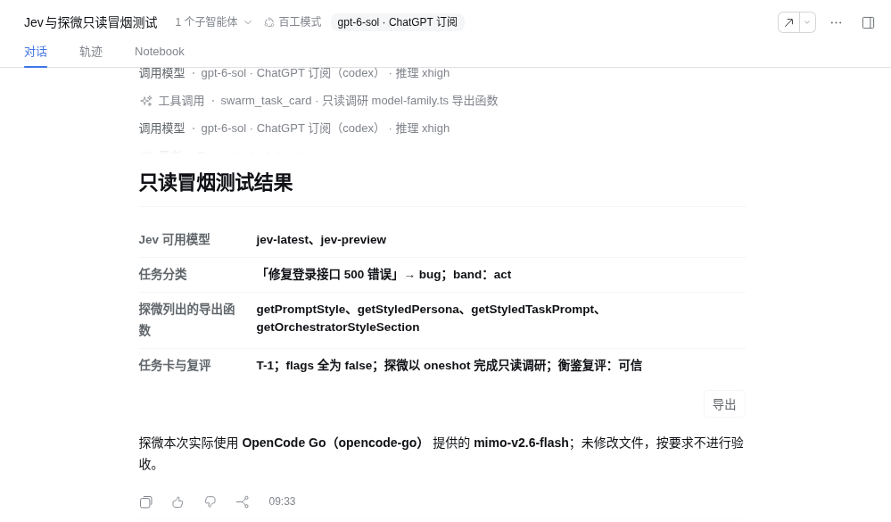
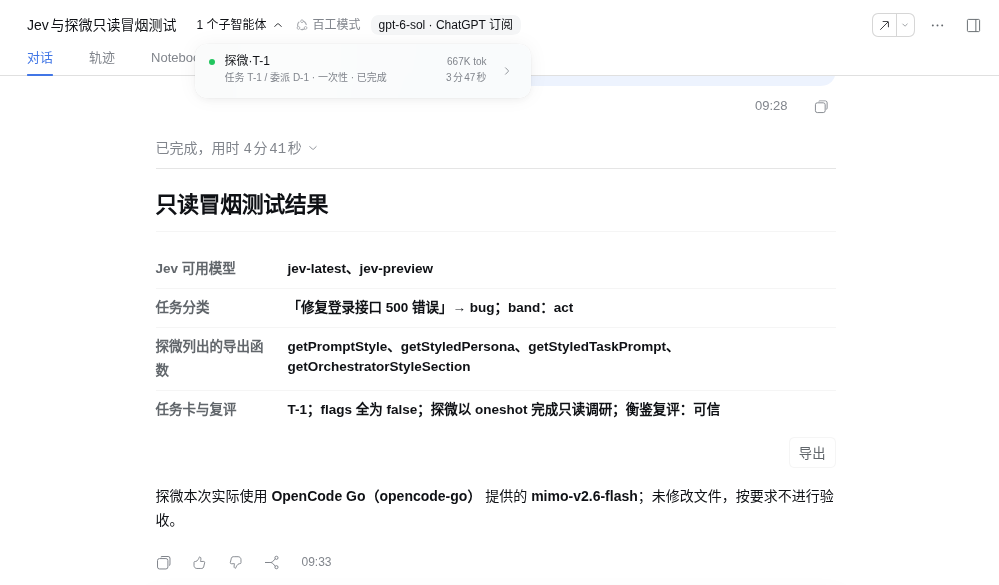
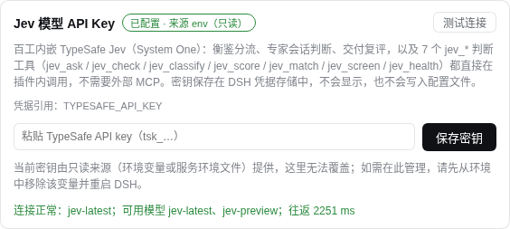
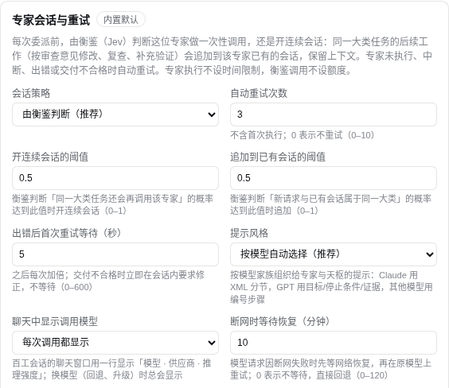
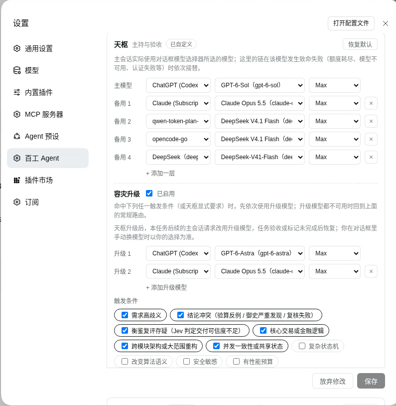

# dsh-agent-swarm

DeepSeek Harness（DSH）的中文多智能体插件：「天枢」主持 12 位中文专家，用任务卡、门禁和证据来决定是否验收；模型路由按你的订阅配置多层回退，故障时立即切到可用备用，并在安全请求边界按配置恢复首选模型。

- 适配 DSH **0.2.0-rc.2**，最低 0.1.7-alpha.2（`package.json` 的 `dsh.testedVersions`）；专家的连续会话需要 0.1.7-rc.2 及以上，更早的版本自动改为一次性调用
- **按模型家族组织提示**：Claude 用 XML 分节、写明约束理由、长材料在前；GPT（Codex）用 Role / Goal / Success criteria / Stop rules 与 GOAL / STOP WHEN / EVIDENCE；其他模型用编号的必做项。专家按实际启动的路由选择风格，天枢按对话框所选模型追加调度说明（参考 oh-my-openagent 的 agent-model-matching 与 Anthropic、OpenAI 官方提示指南）
- **内嵌 Jev**：7 个判断工具与 `jev-judgments`、`typesafe-ai` 技能共用客户端和凭据；所有入口不设插件侧限流或使用额度，保留单次请求超时、体积检查和有限的临时故障重试
- **2.2 任务流程**：任务卡同时记录目标、验收、性能与文件范围；单一 DAG 派生 Mermaid。生成后用官方 parser、独立只读 Agent 和 Jev 核查目标、流程设计、Mermaid 代码；可选择观察或强制执行模式
- **即时回退与受限协作**：额度、余额和模型池耗尽在宿主长退避前回退；版本绑定的每轮检查点、按需上下文、持久专家、P2P 文件邮箱、先盲审再回应、经验候选与有界纯函数数学计算。配置及已验证范围见 [任务流程与验证](docs/任务流程与验证.md)
- **2.4 额度与计算配置**：自动模型链直接读取订阅插件公开的额度窗口与账户模型池信息，已证实上报满额的订阅在同段内后移，仍在 API 前尝试；未知额度保持原链，用户选型与首选恢复受保护。设置可管理 7 组数学算子、数值模式和计算规模，矩阵与多项式默认关闭。验证与限制见 [2.4.0 审核记录](docs/evidence/quota-math-2.4.0/README.md)。
- **持久专家人工控制**：在子对话中选择下一次模型和推理强度，停止卡住的调用后继续同一线程；真正停止前不重启，未知写入需要先核对。
- **探索证据评估**：探微和博闻的来源按可信度、项目关联度、判断集中程度分别评估；代码或任务版本改变后标为需核实，保留原始结果。
- **聊天窗口显示模型**：百工会话每次调用模型都显示「调用模型：模型 · 供应商（路由名）· 推理强度」（可改为只在每轮首次与换模型时显示），回退 / 升级换模型时标为「切换模型」；会话头部显示当前模型；委派结果写明专家使用的模型、供应商与提示风格
- 设计：[docs/V2-完整设计说明.md](docs/V2-完整设计说明.md)
- 代码审计：[运行链路、架构与性能验证](docs/evidence/architecture-performance-2026-10-09/README.md)（2.3.2 代码审计与验证）；[本机升级验证](docs/evidence/local-upgrade-2026-10-09-v2.3.2/README.md)



## 安装

需要 DSH 0.2.0-rc.2（最低 0.1.7-alpha.2）。任选一种方式，装好后重启 dsh：

- **插件市场（dsh-market）**：搜索 `dsh-agent-swarm` 一键安装（市场优先使用 Release 里的预构建包）。
- **预构建包**：
  ```sh
  dsh plugin --profile <profile> add https://github.com/zhairy/dsh-agent-swarm/releases/latest/download/dsh-agent-swarm.tgz
  ```
- **从源码**：`git clone https://github.com/zhairy/dsh-agent-swarm.git && cd dsh-agent-swarm && npm install`（`prepare` 会构建 `lib/`），再 `dsh plugin --profile <profile> add <该目录的绝对路径>`。

装好后：新建会话选「百工模式」；在「设置 → 百工 Agent」顶部填写 Jev API key（不填也能用，衡鉴按规则分流），并按你的订阅调整各角色的模型链。详见 [docs/安装.md](docs/安装.md)。

| 委派结果与专家会话 | Jev API key | 专家会话与重试 | 智能模型设置 |
|---|---|---|---|
|  |  |  |  |


## 组成

```
宿主层（cordis.patch.yml）
  swarm-core ── 提供 agentSwarm 服务：路由 · 策略 · 衡鉴（Jev 分流、会话判断与交付复评）· 专家连续会话与自动重试 · 账本 · 写文件守卫
  swarm-codex / swarm-codex-edit / swarm-claude-plan / swarm-claude-edit ── 原生后端实例（装了官方 bundle 才启用）
  agent-preset-registry ── 默认预设改为天枢

预设层（presets/*.patch.yml，13 个）
  百工模式（天枢）：标准工具 + swarm_task_card / swarm_delegate / swarm_status / swarm_accept；模式列表里唯一的入口
  谋定 枢机 算衡 探微 博闻 观象 铸剑 行舟 疾风 御史 复核 妙笔：按权限裁剪的工具；默认停用，
    委派子智能体不依赖它们；要把某个专家单独作为主会话使用，设 DSH_SWARM_ROLE_PRESETS=1 后重启 dsh
  每个预设都挂 runtime 行：在预设作用域内改写路由、处理失败回退

浏览器端（client/settings-page.js + client/model-display.js → lib/client.js）
  设置 → 百工 Agent：顶部是 Jev API key（保存到 DSH 凭据存储，可测试连接）；「专家会话与重试」配置会话策略、
  自动重试、提示风格、断网等待与天枢恢复时间；纯函数计算配置可管理算子、数值模式与规模；再下面为 14 条角色路由（算衡分研算/验算）配置模型链
  （默认 4 层，可增删；每层选供应商、模型与推理强度），可升级的角色另配容灾升级；写入 swarm-core 的 routes / agents / math，即时生效
  聊天窗口：按真实 attempt 显示实际模型与失败/等待，另列下一次选择；持久子会话提供模型、停止和继续操作
```

角色、权限与默认路由见 [docs/角色.md](docs/角色.md)。

## 快速开始

见 [docs/安装.md](docs/安装.md)。简要步骤：升级 DSH 到 0.2.0-rc.2 → `npm install && npm run build` → `dsh plugin --profile swarm add <本目录>` → 在「设置 → 模型」添加 qwen-token-plan-cn / opencode-go / DeepSeek → `npm run doctor -- --profile swarm` → `dsh --profile swarm web`。

使用方法见 [docs/使用.md](docs/使用.md)，升级与回退见 [docs/升级与回退.md](docs/升级与回退.md)，评测方法见 [docs/评测.md](docs/评测.md)。

## 开发命令

| 命令 | 作用 |
|---|---|
| `npm run build` | 编译 `src/` 到 `lib/` |
| `npm run typecheck` | 类型检查（含测试） |
| `npm test` / `npm run coverage` | 单元测试 / 覆盖率（阈值：行 80%、分支 75%） |
| `npm run test:integration` | 在 `.sandbox/` 安装真实 DSH，用 mock LLM 跑端到端场景 |
| `npm run gen:presets` | 以沙箱 DSH 的 standard 预设为底重新生成 13 个预设 |
| `npm run doctor -- --profile <p>` | 只读检查本机环境（不输出密钥） |
| `npm run sync-dsh -- --version <x>` | 适配新版 DSH：重新生成预设并跑全部测试 |
| `npm run bench:workflow -- --out /tmp/swarm-bench.json` | 20 类控制面基准、6 类计算基准；模型用量必须另行导入真实记录 |

## 验证状态

| 项目 | 沙箱（DSH 0.2.0-rc.2 + mock LLM） | 需在本机用真实账号验证 |
|---|---|---|
| bundle 安装、13 个预设、默认预设 | ✓ | 升级后执行 `doctor` |
| 委派、工具白名单、写文件守卫 | ✓ | — |
| 门禁拦截与验收 | ✓ | — |
| 子智能体与主会话的路由回退 | ✓（真实 Cordis/Retry/AgentLoop，含 9060669ms 模型池案例） | 原生后端内部重试、prepareCall 阶段及真实 provider 的失败码 |
| 视觉拒收与截图入库 | ✓ | 真实视觉模型的识别质量 |
| Jev 分流与严格路径、7 个 jev_* 工具 | ✓（本地 mock 服务与单元测试）；本次实现另有真实 Jev MCP 辅助审核 | 完整在线模型任务的质量评测 |
| 首选模型恢复、人工选模与同线程继续 | ✓（真实 Host，含跨进程恢复和真实写入不重放） | 模拟供应商覆盖生命周期，实际账号可用性须独立核对 |
| 原生 Codex / Claude Code | 仅验证「未安装时退回 API」 | 登录后的真实调用 |
| V2 设计稿 §8 的 20 题评测 | 另已运行 20 类本地控制面基准 | 完整在线评测与 token 节省；28% 尚未测得 |

## 许可证

MIT，见 [LICENSE](LICENSE)。内嵌的 Jev 工具改编自 jev-mcp 0.2.1（MIT），`skills/typesafe-ai` 收录自 TypeSafe AI（MIT），详见 [THIRD-PARTY-NOTICES.md](THIRD-PARTY-NOTICES.md)。
