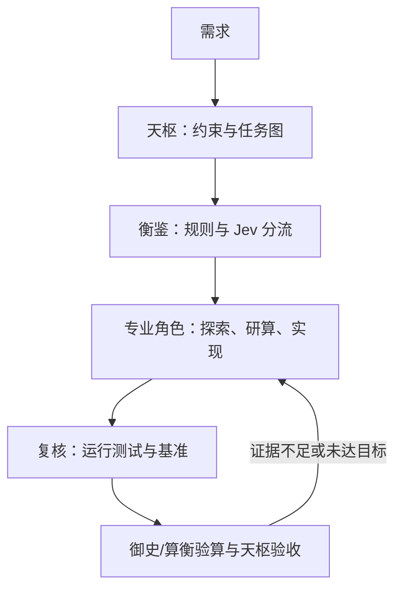

# dsh-agent-swarm：DSH 中文多智能体插件 V2 完整设计说明

版本：V2 完整设计稿，2026-09-23。**项目、npm 包与插件显示标识统一使用 `dsh-agent-swarm`**；人类可读的智能体角色名全部使用中文。适用前提：你已有 DSH、`dsh-web-search-free` 及六个搜索 API；可用资源为 ChatGPT Plus、Claude Pro、DeepSeek API、OpenCode Go、Jev API。本文定义一次构建的完整交付范围与验收标准，尚不是已构建的插件。模型 ID、订阅权限、工具配置字段以本机安装的 DSH 版本和账号实测为准。

## 1. 目标和边界

目标是让不同角色处理适合自己的工作，同时用可复现的证据选择代码：功能正确、满足性能预算、容易维护、改动范围合理、运行费用可控。不存在对任意需求都客观唯一的“最佳代码”；系统追求的是**在明确约束、给定工作负载和已验证候选中最适合的实现**。

插件分为四部分：中文角色与预设、路由决策、受控委派、质量门禁与审计。现有搜索插件作为共享工具使用，沿用六个 API key 和既有优先级；`dsh-agent-swarm` 不重新实现联网搜索，也不复制密钥。一个 DSH 主会话由「天枢」主持；**13 个生成角色全部在 V2 交付时可用**，加上作为路由服务的「衡鉴」。角色都能被调用，但不会无条件参与每个任务。



## 2. 角色与模型来源

角色中文命名；模型是可更换的路由配置，不能写死在角色的 persona 中。下表是初始**候选映射**，并非未经本机实测的“各领域第一”排名。优先保证任务所需能力、实际授权方式、服务稳定性，然后才比较成本。

| 角色 | 交付物及权限 | 初始候选来源 |
| --- | --- | --- |
| 天枢 | 定义验收标准、控制委派和预算、裁决证据；主会话 | DSH 当前可用强推理主模型，优先 DeepSeek API 的已验证模型；Codex 作为关键咨询子任务 |
| 谋定 | 需求分解、方案和约束；只读 | Codex 子任务或 DeepSeek 强推理 |
| 枢机 | 架构、故障边界、并发与数据流；只读 | Claude Code 或 Codex 子任务 |
| 算衡 | 数学建模、算法候选、复杂度和数值稳定性；`研算`与`验算`两种模式，一个角色，两次独立调用；只读 | 研算用经实测的强推理模型；验算尽量用不同模型家族，必要时双路 |
| 探微 | 代码索引、调用关系和证据定位；只读 | OpenCode Go 的 MiMo/其他经仓库任务评测合格模型 |
| 博闻 | 外部文档、论文、RFC、版本资料；只读 | OpenCode Go 的 MiniMax/Kimi 等，调用既有搜索工具 |
| 观象 | 解读截图、图表、设计稿和视觉回归差异；只读图片和相关上下文，输出可核对的观察 | 在 DSH 中经图片输入实测的视觉模型；OpenCode Go 的视觉候选需逐一验证 |
| 铸剑 | 实现复杂代码和重构；允许工作区编辑 | Claude Code、Codex，或经代码任务评测的 OpenCode Go 模型 |
| 行舟 | 依照已确定的步骤执行命令、构建、迁移演练与批处理；限范围执行 | DeepSeek Flash 或经工具调用测试的 OpenCode Go 快速模型；实际命令由 DSH 工具执行 |
| 疾风 | 局部、低风险改动；允许限范围编辑 | DeepSeek Flash 或 OpenCode Go 低成本模型 |
| 御史 | 独立工程审查、安全、维护性、性能回退；只读 | 与铸剑不同的模型家族 |
| 复核 | 建立并执行验证计划，归集测试、构建、类型检查、基准和回归证据，解释失败；只读代码、可运行经授权的验证命令 | DeepSeek Flash 或 OpenCode Go 低成本模型；关键结论由测试工具产生 |
| 妙笔 | UX 文案、命名、帮助说明、交互文案和创意备选；只读，提供候选及理由 | Codex/Claude 的可用强表达模型或经中文写作评测的 OpenCode Go 模型 |
| 衡鉴 | 分类、升级、风险提示；结构化服务，不生成代码 | 显式规则 + Jev API |

「复核」是**正式的可调用智能体**：准备验证计划、调用实际测试工具、解释失败并生成证据报告。测试、静态检查和基准本身仍是确定性工具，不能由「复核」口述替代。**行舟与复核的边界**：行舟按既定步骤执行通用命令/构建/迁移演练；复核选择和执行验证项目、判定覆盖范围及失败原因。**行舟与疾风的边界**：行舟不自行改写业务逻辑；疾风直接修改小范围代码。**观象与铸剑的边界**：观象指出图片中可见事实及位置，铸剑结合代码和需求决定实现。**妙笔与谋定的边界**：妙笔提供表达和体验方案，谋定确定功能约束；最终取舍由天枢按任务卡验收。

观象的触发条件是用户提供截图、设计稿、图表或视觉回归产物。它使用经实测的图片输入模型；如果当前主模型仅接收文本，DSH 可能在工具调用之前拒收图片，此时切换已验证的视觉会话或使用经过实测的图片桥接路径，不能只把「观象」名字写进 persona。妙笔处理界面文字、导航名称、错误提示等任务；文案需符合用户语言与产品约束，行情/交易术语由业务角色复核。行舟处理可复现的命令序列，写入、迁移或删除操作按 DSH 实际权限策略限制范围；高风险命令先产出演练和影响清单。复核在任何有代码改动的任务中至少执行相关验证，对纯文案任务只检查文案约束，不空跑构建。

### 2.1 所有角色的触发条件与交付契约

| 角色 | 典型触发 | 必须交付 |
| --- | --- | --- |
| 天枢 | 每个主任务 | 任务卡、选用角色与理由、验收结论、未解决问题 |
| 谋定 | 多目标或需求模糊 | 约束表、候选方案、决策点与任务依赖 |
| 枢机 | 跨模块架构、并发、数据流 | 边界与接口、故障场景、迁移/回退方案 |
| 算衡 | 数学定义、算法、性能与语义权衡 | 前提、不变量、证明义务、反例、复杂度和数值误差；验算独立完成 |
| 探微 | 不清楚代码位置/调用链 | 路径、符号、调用链及对应证据 |
| 博闻 | 需要最新外部事实、RFC 或论文 | 来源、日期、适用版本、可验证的要点 |
| 观象 | 有截图、设计稿、图表或视觉差异 | 观察到的区域与元素、可见证据、推断与不确定性 |
| 铸剑 | 跨文件实现、重构、困难修复 | 最小充分 diff、实现说明、待验证假设 |
| 行舟 | 已确认步骤需要执行 | 命令、环境、退出码、产物和未执行原因 |
| 疾风 | 独立的小改动 | 小范围 diff、局部验证 |
| 御史 | 代码高风险或实现完成 | 严重度分级问题、复现途径与具体建议 |
| 复核 | 代码改动、算法改动、发布前复查 | 实际运行的验证命令、结果、覆盖边界和失败解释 |
| 妙笔 | UI 文案、命名、说明、创意 | 2–3 个受约束备选、适用场景与推荐理由 |
| 衡鉴 | 路由不明确、决定额外复核与升级 | 结构化分类、置信度、采用的规则及回退原因 |

### 2.2 模型映射与路由规则

路由顺序：**强制安全/正确性规则 → 任务能力 → 已验证的接入方式 → 模型质量实测 → 配额与成本 → 备用模型**。每个角色记录 `primary`、`fallbacks`、`capabilities`、`executionMode`、`permission` 与 `budget`。名字只代表职责：不能因为某模型在排行榜上领先就跳过本机任务评测。

V2 默认建议：天枢用已在 DSH 可用的 DeepSeek 强推理模型；谋定/算衡的疑难任务可以调 Codex，枢机/铸剑可调 Claude Code，探微优先考虑经大仓库验证的 MiMo，博闻可考虑 MiniMax/Kimi，御史优先选与实现者不同的模型家族；行舟/疾风/复核优先走经工具调用验证的低成本模型；观象必须用明确支持图片的端点，妙笔使用中文表达经实测合格的模型。所有候选均由用户实际可用的 DeepSeek API、OpenCode Go、Codex 订阅路径和 Claude 原生子智能体路径提供，不能把 ChatGPT Plus/Claude Pro 伪装为可任意调用的 API key。

每个委派记录 `taskId`、中文角色名、逻辑模型别名、实际 provider/model、选择依据、输入摘要、权限、执行证据、费用/额度及失败状态。相同角色可以在两个任务中选择不同后端；**原生 Codex/Claude Code 实例的模型通常由静态配置指定**，路由器只能在事先注册的实例间选取。实现者与御史/算衡验算者默认异模型、异上下文；不能做到时在结果中明示未实现独立性。

接入约束：ChatGPT Plus 提供 Codex 客户端使用额度，**不等于 OpenAI API 余额**；DSH 的 Codex backend 是一次性子智能体，不能默认把 Plus 当作 `ctx.llm` 主模型。Claude Pro 的非交互 Agent SDK/`claude -p` 计费与交互 Claude Code 不同，需核实账号的专用额度设置。OpenCode Go 有 API key，但官方指出当前 DSH 某些模型路径缺少会话头；只有通过实际多轮工具调用、计费和限制测试，才启用相关模型。不同 Go 模型走 chat/completions、messages 或 responses，不应假设一个兼容 endpoint 通吃。

## 3. 用什么标准判断“足够好”

### 3.1 先定义约束，再写实现

天枢为每项任务生成可核对的任务卡：输入输出及非法输入、正确性不变量、原有 API 兼容、关键运行环境、p95/p99 延迟或吞吐及数据规模、CPU/内存/I/O 上限、需要保留的可读性和扩展点。未知参数标注“待测”，不能假装有性能目标。

分为两层：

1. **硬门槛**：正确性、数据安全、兼容性、关键测试、不得有未来数据泄漏，以及任务明确给出的资源上限。任一失败即不接受。
2. **软取舍**：在硬门槛内比较实现复杂度、可维护性、平均性能、开发和推理成本。正常工作负载下，优先选择边界清晰、最容易理解的候选；只有测得明显收益且业务需要，才增加缓存、并行或增量状态。

衡量复杂度不看代码行数或一个抽象分数：查阅新增概念、状态变量、分支、跨模块依赖、运行依赖、调试步骤和故障恢复成本。过度简化的征兆是遗漏边界/取消异常/删除必要不变量；过度复杂的征兆是在没有测量或需求的情况下引入框架、多级抽象、缓存或并发。

### 3.2 可执行质量门禁

| 阶段 | 必须保存的证据 | 不通过怎么办 |
| --- | --- | --- |
| 需求 | 任务卡、基线行为、风险分级 | 缺失关键约束则先补实测或明确假设 |
| 算法 | 不变量、边界/反例、复杂度与精度说明 | 交给算衡研算和独立验算 |
| 实现 | 小范围 diff、取舍说明、无意外文件变动 | 收窄改动或重构 |
| 功能 | 复核实际运行单元/集成测试、回归及基准实现对照 | 修复，不能用主观评语放行 |
| 性能 | 可复现输入、机器、重复次数、延迟分布和内存/I/O；仅关键路径必做 | 分析热点，比较候选；未测时不得称“更快” |
| 审查 | 按严重程度列出的独立发现与处理结果 | 关键缺陷归零；争议由证据裁决 |
| 验收 | 所有硬门槛通过、未解决风险公开、停止理由 | 不合格则重新设计或诚实标注未完成 |

标准路径只需一个实现。对于性能热点或算法核心，保留清晰基线 A，提出至多两个有实际理由的候选 B/C；先跑相同的正确性测试与差分测试，再用代表性和极端负载比较。若优化收益低于测量噪声或不满足预先声明的收益阈值，选择更简单的实现。对多个维度不存在支配关系时，天枢记录选择理由和工作负载，而不伪造“全局最优”。

停止准则：硬门槛全过，复核的工具证据和独立审查没有未处理的严重问题，关键指标满足预算；进一步改动预计收益不足以抵消复杂度与回归风险。不能把“两个模型都觉得对”当作通过。复核可以建议补测，不能篡改工具输出或单凭模型评分放行。

## 4. 算衡与 Jev 的正确分工

**建议引入，但作为算衡的入口与复核调度器，不让 Jev 推导公式或证明。** Jev 接受有限选项的 `choice`、分级的 `score` 和二元概率 `noul`，适合在不确定时触发独立验算、基准或人工复核；它可能误判，输出置信度也不是数学正确性的证明。

确定性规则始终优先：涉及资金、交易委托、时间序列未来信息、策略回测、状态机、数值精度、并发共享状态时，强制算衡验算，不允许 Jev 的低风险结果关闭门禁。Jev 只决定**额外工作**的预算与顺序；调用失败或置信度低时按较严格路径运行。动态分流的阈值以本地标注任务集调参，不直接采用网上示例的 0.7/0.8 作为可靠安全阈值。

示意请求（字段形状参照 Jev API；不包含源码、密钥或敏感数据）：

```json
{
  "model": "jev-latest",
  "state": {
    "task": "优化实时缠论笔的增量更新",
    "touches_financial_logic": true,
    "has_reference_implementation": true,
    "changes_algorithm": true,
    "profile": {"n": 1000000, "latency_budget_ms": 50}
  },
  "questions": {
    "math_task": {
      "type": "choice",
      "instructions": "选择此任务需要的数学检查类型；按最高必要强度选择",
      "criteria": {
        "ordinary": "只改变工程实现，不改变算法语义",
        "invariant": "需要检查边界条件、状态不变量或数值精度",
        "equivalence": "增量和全量实现需要语义等价验证",
        "research": "需要设计新算法并比较复杂度、正确性和性能"
      }
    },
    "need_benchmark": {
      "type": "noul",
      "instructions": "是否有性能目标或关键数据规模要求，需做可重复基准测试"
    },
    "novelty": {
      "type": "score",
      "instructions": "算法变化的程度",
      "criteria": ["行为不变的局部调整", "改变状态或边界处理", "提出新算法或语义"]
    }
  }
}
```

程序只读取 `answers.math_task.choice/confidence`、`answers.need_benchmark.noul` 和 `answers.novelty.score/confidence`；**`noul` 没有 confidence 字段**。例如 `need_benchmark.noul` 是对描述的概率判断，不是基准合格分数。验算输出必须包含：前提、定义、不变量、结论、证明或反例、未覆盖范围；数值结论附可重现程序与数据。独立验算者初次只拿需求和候选实现/规格，避免先读研算者结论产生锚定。

## 5. 任务路由与执行协议

1. 天枢收集仓库范围、现有测试和性能基线，生成任务卡。
2. 规则引擎给出必须执行的门禁；衡鉴可用 Jev 对非强制路径作分类。对纯规则可判定的任务不调用 Jev。
3. 探微/博闻收集证据；博闻使用已安装的 `dsh-web-search-free`。带图任务交给观象提供视觉观察；算衡检索仅用于获取定义、论文、标准和原始 benchmark，不能用搜索摘要代替推导。
4. 对算法任务，算衡·研算在实现前定义语义和复杂度；天枢选择路线。设计界面的任务让妙笔提出文案与交互备选。铸剑或疾风在限定工作区实现。
5. 行舟执行已确定的命令和构建步骤；**复核作为独立角色**决定相关的验证集合，实际运行测试、类型检查和基准，解释失败并报告覆盖范围。算衡·验算负责语义和反例，御史负责独立工程审查。带图变更由观象比对实际截图和目标图；实现与审查尽量使用不同模型家族和不同上下文。
6. 天枢检查证据、复杂度与收益，决定接受、修复或报告尚未满足的要求。回路最多两轮自动修复；超过预算则给出阻塞原因。

默认按风险分层：微小低风险任务只调用疾风与复核；一般代码任务为铸剑/疾风加复核；架构、并发与算法任务增加独立审查；交易/量化核心再增加算衡双路和差分/性质测试。行舟只在有明确执行步骤时参与，观象只在有视觉输入/产物时参与，妙笔只在用户体验与表达需要时参与。**低频是调度频率，不是功能缺省**；这些角色在 V2 都有可用入口与独立验收。严禁仅凭角色投票跳过硬门槛。

| 用户请求 | 典型路径 | 附加验收 |
| --- | --- | --- |
| “把 FastAPI WebSocket 服务跑起来并记录失败” | 天枢 → 行舟运行 → 复核验证，异常时转枢机/铸剑 | 命令退出码、服务状态与日志 |
| “按照截图修改量化看板，并把操作说明写成中文” | 天枢 → 观象＋妙笔 → 铸剑 → 行舟构建 → 复核测试 → 观象复看＋御史 | 目标截图与实际渲染、交互、可访问性和文案 |
| “修复笔的增量更新和性能” | 天枢 → 探微 → 算衡·研算 → 铸剑 → 复核运行差分/基准 → 算衡·验算＋御史 | 差分测试、未来数据约束与可重复基准 |

### 量化系统的专项验收

以“缠论增量笔更新”为例：固定包含关系、分型确认与笔成立规则；离线全量算法作为参考实现。用相同 K 线序列逐根推进，比对每个时点已确认结构与增量结果；加入重复时间戳、缺口、乱序、最后未收盘 K、同价极值和跨周期边界。无未来数据泄漏、确定性回放、最坏输入资源界以及生产规模的 p95/p99 更新延迟，均作为任务卡硬约束。若定义本身有多种合法解释，先由你选定业务语义，再讨论优化。

## 6. DSH 实现结构与接口约束

```
dsh-agent-swarm/
  package.json              # name=dsh-agent-swarm；声明 dsh.bundle.patch
  cordis.patch.yml          # bundle 层：插入服务、统一委派工具、13 个预设定义
  tsconfig.json
  src/
    index.ts                 # Cordis apply，注册工具/服务
    role-registry.ts         # 13 角色、模式、工具与输出契约
    routes.ts                # 中文角色 -> 候选 provider/model + 能力
    policy.ts                # 强制门禁、预算、冲突/失败策略
    jev.ts                   # Jev API 适配、超时、脱敏
    delegate.ts              # 角色委派、静态 provider 适配
    evidence.ts              # 实测证据、决策记录及退出原因
    verification.ts          # 复核角色的测试计划和结果收集
    vision.ts                # 图片能力检查与观象任务交接
  config/
    roles.example.yaml      # 模型别名、后端实例、预算；无真实密钥
    policy.example.yaml     # 必选角色、验证级别、失败策略
  presets/
    天枢/agent.cordis.yml    # 源配置，构建时编入 bundle 声明
    谋定/agent.cordis.yml
    枢机/agent.cordis.yml
    算衡/agent.cordis.yml
    探微/agent.cordis.yml
    博闻/agent.cordis.yml
    铸剑/agent.cordis.yml
    行舟/agent.cordis.yml
    疾风/agent.cordis.yml
    御史/agent.cordis.yml
    复核/agent.cordis.yml
    观象/agent.cordis.yml
    妙笔/agent.cordis.yml
  tests/
    route-fixtures.json
    policy.test.ts
    role-contracts.test.ts  # 所有角色都有可触发路径与相应权限
    integration.test.ts
    vision-admission.test.ts
  docs/
    安装.md
    使用.md
    角色.md
```

DSH 的 Cordis 插件由 `apply(ctx)` 注册；预设管理角色 persona、工具和技能；工作流与子智能体是不同 seam。上面的 `presets/` 仅是插件源码组织方式，**DSH 的预设注册器不会自动扫描这些目录**：构建产物必须通过 bundle 的 `cordis.patch.yml` 插入 `@deepseek-ai/dsh-agent-preset` 声明行，角色 ID、中文显示名和子插件由声明明确指定；发布时需要在 `package.json` 声明 `dsh.bundle.patch`。不要把仅有源码 YAML 的目录误认为已安装预设。

**注意修正前一版设计中的接入误导**：

- DSH 原生 Codex/Claude Code backend 的 provider/model 由预设中的实例配置固定，工具行静态指向 provider；不能假设一次 `delegate_expert` 调用就能随意热切换其模型。V2 为每种已认证后端配置独立实例/工具，由 `dsh-agent-swarm` 做角色选择；细节按安装版本校验。
- DSH `workflow` 的 `agent()` 可以针对支持的 LLM 子任务指定 `provider`/`model`，但这不等于原生 Codex/Claude Code backend 也支持相同的逐次覆盖。前者用于纯咨询、研究、并行分析；会编辑同一工作区的任务不并行启动，避免覆盖冲突。

`dsh-agent-swarm` 面向主会话暴露「委派专家」和「查询任务状态」两类工具，内部记录 `role/task/risk/evidence_budget/provider_instance`，实际调用原生子智能体或 LLM 工作流。统一委派入口展示中文角色名，不把多个底层 provider 工具堆到主提示词；运行时可公开审计记录，但不透出密钥。需要先验证所用 DSH 版本公开的 `ctx.tools`、`ctx.subagents` 和 preset 配置字段；这里的源码结构与接口参数属于**设计接口**，不能直接复制到 DSH 当成可运行配置。

### 6.1 稳定标识与权限

面向用户显示中文角色名，内部使用稳定 ASCII ID，例如 `tian_shu`、`suan_heng`、`fu_he`；配置和日志同时保留 ID 与中文名，避免中文路径/跨平台编码影响包管理。每个角色的工具集由其**DSH 原生会话预设**明确列出，不靠提示词约束权限：探微、博闻、观象、妙笔、御史默认只读；铸剑和疾风可在用户工作区编辑；行舟只运行约定命令；复核可运行验证命令、写测试临时产物但不应自行修改业务文件；算衡研算/验算分开创建上下文。预设不是安全沙箱，最终权限仍以 DSH 工具、文件策略和子进程实际设置为准。

**原生外部子智能体的限制**：Codex 与 Claude Code backend 的一次性调用不接受 DSH 的逐次 `agentOptions`、child persona、工具过滤或输出 schema；它们也不因天枢的预设而自动继承 13 个角色的工具集。`dsh-agent-swarm` 为这类任务创建自包含的中文角色指令和验收合同，在原生 CLI/SDK 实例上设置允许的 permission mode；需要硬隔离工具或严格输出 schema 时改用支持这些能力的 in-process 子智能体，或由宿主校验返回文本并将不合格结果判为失败。角色名称无法替代真正的执行权限。

### 6.2 路由与结果的内部契约（示意）

```ts
type RoleId =
  | 'tian_shu' | 'mou_ding' | 'shu_ji' | 'suan_heng'
  | 'tan_wei' | 'bo_wen' | 'guan_xiang' | 'zhu_jian'
  | 'xing_zhou' | 'ji_feng' | 'yu_shi' | 'fu_he' | 'miao_bi'
type Route = {
  role: RoleId
  primary: { backend: string; modelAlias: string }
  fallbacks: Array<{ backend: string; modelAlias: string }>
  requiredCapabilities: Array<'tools' | 'code' | 'vision' | 'reasoning'>
  permission: 'read' | 'workspace-edit' | 'limited-exec' | 'verify'
  maxCalls: number
}
type TaskResult = {
  taskId: string; role: RoleId; status: 'completed' | 'failed' | 'blocked'
  summary: string; evidence: Array<{ kind: string; ref: string }>
  modelRoute: string; unresolved: string[]
}
```

上面是插件自己的配置/返回值规范，**不是 DSH 已发布的 TypeScript API 声明**。`delegate` 校验角色、权限、模型能力和预算；图片能力不足时 `guan_xiang` 返回可解释的阻塞状态，不把截图偷偷降为无标注的文本推断；复核结果缺少测试日志或退出码时不能标为通过。

### 6.3 状态与失败闭环

一次委派依次处于 `queued → running → completed/failed/blocked`。后端 429/超时可在预算内重试，再切换同能力的备用实例；认证失败不重复盲试，视觉不支持不得回退到纯文本模型。任一强制角色不可用（如算法验算或复核）时，天枢不得把任务标记为已验收。对子任务实施调用次数和总时长上限；取消任务后检查已产生的文件修改，取消不等于自动回滚。不可并发写同一批文件；只读探索、资料检索、独立审查可以并行。

## 7. 模型、搜索和资源治理

- ChatGPT Plus：Codex 经过原生授权用于高价值的一次性子任务；其使用限制不能从 Plus 订阅推导出 OpenAI API 可用额度。
- Claude Pro：原生 Claude Code backend 可作为执行/架构资源；非交互 Agent SDK 消耗独立的 SDK 月度额度，超过额度的行为取决于账号计费设置。限额未核实前设调用上限。
- DeepSeek API：适合主会话或可控成本的 LLM 任务，模型 ID 从当前 API 和本机 DSH 获取。
- OpenCode Go：按真实 endpoint 和模型 ID 分组配置；发送其要求的会话信息并做兼容性验证。模型列表、额度均可能变动。
- Jev API：只发送脱敏结构化任务摘要，设置超时、重试和调用预算；发生限流时走明确的规则回退。
- 已有搜索：保留六个 API key 和原插件配置；只给博闻默认搜索权限，枢机、算衡及需要核对实时事实的妙笔按需授予。观象处理用户图片无需调用网络搜索；保存外部来源 URL/日期和检索版本，优先原始文档。
- 视觉模型：在 DSH 的 Settings → Models 为经端点确认支持图片的模型设置 Image 输入并做一张截图的实际测试；声明图片能力不会自动使文本模型具备视觉能力。记录模型版本与图片大小限制，文字识别结果须与原图核对。

记录每项任务的调用次数、token/订阅消耗、延迟、模型版本、失败和审查结果。不要把密钥、个人数据或交易凭据送入多模型上下文。先以固定 fixture 评估路由准确率、遗漏严重问题率、预算和完成时间；再打开自动路由。路由评测与代码质量评测分开进行。

## 8. V2 一次交付清单和完成标准

**构建范围不拆成“V1 核心、V2 再补角色”**。开发内部可以按依赖顺序推进，但最终一次交付必须同时具备：可安装的 `dsh-agent-swarm` bundle、13 个中文角色、衡鉴 Jev/规则路由、统一委派入口、搜索插件共存、完整的测试/审查/数学/视觉闭环、可核对的使用说明和错误回退。

| 交付模块 | 必备结果 | 验收方法 |
| --- | --- | --- |
| 接入清查 | 记录本机 DSH 版本、所用 web profile、搜索工具名与六个 API、Codex/Claude 原生授权、DeepSeek/Go/Jev 可达性 | 本机最小只读调用和配置检查；不收集用户密钥 |
| Bundle 与预设 | `package.json` 声明 `dsh.bundle`；补丁注册 13 个中文角色；主预设可选择 | 安装到现有 profile 后 `--dump-config` 可见声明，新会话逐个能创建 |
| 路由与权限 | 规则优先、Jev 判断额外路径、模型能力和配额回退、工具权限受控 | 用固定任务集验证角色选择和强制门禁 |
| 角色功能 | 第 2.1 节全部 13 个交付契约有可触发实用路径 | 每个角色至少一条端到端任务；复核、行舟、妙笔、观象须实际被调用 |
| 搜索与视觉 | 博闻能调用现有搜索插件；观象能接收真实截图；图片能力不匹配可解释 | 保留原六个搜索 API；截图输入、可见元素检查和文本模型失败路径 |
| 代码质量 | 普通/复杂/算法任务各自经过适当复核与独立审查 | diff、命令日志、测试、复杂度和基准记录可复现 |
| 降级与安全 | 配额耗尽、Jev 超时、搜索不可用、认证失败、取消和权限拒绝均返回准确状态 | 故障注入，不把失败报告为完成；取消后检查副作用 |
| 安装与操作 | 本机安装、模型/预设选择、自然语言任务示例和卸载/回退步骤 | 按文档从空会话完成一遍示例任务 |

评测样本建议从你仓库取至少 20 个有标准答案或历史缺陷的任务，覆盖 5 个算法/时间序列边界案例，并另列四个必测案例：命令执行、中文文案、截图理解、复核发现失败。样本数量只是试运行规模；正式阈值根据你的实际任务设定。统计严重缺陷漏检、预算、测试通过率、性能结论可复现比例。**只有全部角色契约及交付模块通过，才称 V2 构建完成。**

## 9. 构建完成后，如何在 DSH 中使用

以下是**未来 `dsh-agent-swarm` 完成构建、生成可安装 bundle 后**的操作；当前设计稿不是插件包。以你正在使用的 Web profile 为例，先确认搜索插件已装在同一个 profile 中。安装命令中的 `/绝对路径/dsh-agent-swarm` 指构建好的本地插件包目录，不能指向本说明文档：

```bash
dsh plugin --profile web add /绝对路径/dsh-agent-swarm
dsh --profile web --dump-config
dsh web
```

`package.json` 必须包含 `"dsh": {"bundle": {"patch": "./cordis.patch.yml"}}`，否则 `add` 只安装依赖，不会启用角色或工具。`--dump-config` 用于本机确认 `dsh-agent-swarm` 的配置行和 13 个预设定义已经进入最终组合；配置内容可能包含本机设置，请勿直接贴出敏感项。对正在运行的 Web profile 新增 bundle 后，应重启该 profile。请在你已有的 `web` profile 中安装，避免创建一个全新且没有 `dsh-web-search-free` 的 profile。DSH 对后续运行时配置补丁的重载以实际版本与 HMR 设置为准。

打开 DSH Web 界面后，选中量化项目目录作为 Workspace，在 Settings → Models 确认主模型及需要的视觉模型可用；在新建会话时选择「天枢」预设。如果插件设计为把「天枢」设为默认，普通新会话也会进入天枢。角色预设是会话配置，**不是只靠在聊天中写“你现在是天枢”就获得对应工具**。你可以指定工作偏好，但实际模型选择、工具权限和成本预算由安装的配置决定。

你只需以自然语言提交目标和验收条件，无须手动逐个打开子角色。例如：

> 检查我的 FastAPI WebSocket 模块是否有并发问题，尽量保持现有结构。修复后运行现有测试并说明剩余风险。

天枢建立任务卡后选探微/枢机查边界、让铸剑改代码、行舟执行既定启动步骤、**复核真正运行测试并归档结果**，御史独立审查，最后返回改动文件、测试证据和未解决项。另一种显式指派方式是：

> 请先让「观象」分析这张图中的 K 线布局，再让「妙笔」提出中文按钮及错误提示文案，最后由「铸剑」实现；请「行舟」构建、「复核」执行测试，最后让「观象」对照新截图检查视觉结果。

若要只做数学研讨，可选择「算衡」专用预设或对天枢说“只做研算/验算，不修改代码”；只做文案可选「妙笔」；只要求检测已有项目时可说“交给复核运行检查并解释失败，不修改业务代码”。如果没有图片能力的会话无法上传截图，先切换到已验证的视觉模型；插件无法绕过 DSH 的图片输入限制。对于要求执行脚本的任务，行舟按 DSH 的工具授权执行；其输出必须列出命令、退出码和关键产物，不能用“已完成”替代执行证据。

最后在 Web 会话中核对三种结果：①任务卡和被使用的角色；②文件 diff、复核的测试输出、基准和御史意见；③天枢的验收与停止原因。若某模型额度耗尽、搜索失败、图片被拒收或命令权限不够，系统应说明具体失败和采用的备用路径，不把缺失证据写成通过。需要停用时运行 `dsh plugin --profile web remove dsh-agent-swarm` 并重启 Web profile；此操作不删除工作区的用户文件和已安装的搜索插件，具体历史会话行为以 DSH 版本为准。

### V2 设计自检记录

- **完整性**：十三个中文生成角色和衡鉴进入角色表；复核、行舟、观象、妙笔同时进入触发条件、工作流、目录、资源治理、交付标准与使用示例。
- **职责冲突**：行舟与疾风/复核、观象与铸剑、妙笔与谋定的分工已明确；复核是真实 Agent，调用确定性工具作证据；衡鉴保持结构化路由服务。
- **DSH 可部署性**：修正“目录自动成为预设”的错误；增加 bundle patch、同 profile 安装、dump-config、重启及 Web 选工作区流程。精确工具注册配置仍须根据实际 DSH 版本开发和测试。
- **视觉与质量**：观象需实测图片端点及会话输入；Jev 的结果不能替代数学验证；普通任务无需拉起所有角色。本文只审查设计说明，没有在你的 Debian 主机上安装或运行插件。

## 参考资料（2026-09-23 核对）

- [DSH 官方仓库与 developer preview 声明](https://github.com/deepseek-ai/deepseek-harness)
- [Cordis 插件教程](https://github.com/deepseek-ai/deepseek-harness/blob/master/docs/cordis-tutorial/01-first-plugin.md)
- [DSH preset 包说明](https://github.com/deepseek-ai/deepseek-harness/blob/master/packages/preset/README.md)
- [预设注册器与声明方式](https://github.com/deepseek-ai/deepseek-harness/blob/master/packages/preset/agent-preset-registry/README.md)、[Agent preset 包](https://github.com/deepseek-ai/deepseek-harness/blob/master/packages/preset/agent-preset/README.md)
- [插件打包、安装和 profile 配置层](https://deepseek-harness.github.io/deepseek-harness/en/develop/basic/publish)、[CLI 行为](https://github.com/deepseek-ai/deepseek-harness/blob/master/apps/cli/reference/README.md)
- [Web UI 选工作区并执行任务](https://github.com/deepseek-ai/deepseek-harness/blob/master/docs/user/guide/index.md)、[模型与图片输入配置](https://github.com/deepseek-ai/deepseek-harness/blob/master/docs/user/guide/providers.md)
- [DSH workflow seam](https://github.com/deepseek-ai/deepseek-harness/blob/master/docs/subsystems/workflow.md)、[tool-workflow](https://github.com/deepseek-ai/deepseek-harness/blob/master/packages/workflow/tool-workflow/README.md)
- [DSH Subagent 能力协商与不同 backend 的能力限制](https://github.com/deepseek-ai/deepseek-harness/blob/master/docs/subsystems/subagent.md)
- [DSH Codex 子智能体](https://github.com/deepseek-ai/deepseek-harness/blob/master/packages/subagent/subagent-codex/README.md)、[Claude Code 子智能体](https://github.com/deepseek-ai/deepseek-harness/blob/master/packages/subagent/subagent-claude-code/README.md)
- [Jev 官方问题类型](https://docs.typesafe.ai/primitives.md)、[置信度](https://docs.typesafe.ai/confidence.md)、[API 索引](https://docs.typesafe.ai/llms.txt)
- [OpenCode Go 模型与端点、DSH 已知兼容性说明](https://opencode.ai/docs/go/)
- [Codex 使用 ChatGPT 订阅](https://help.openai.com/en/articles/11369540-using-codex-with-your-chatgpt-plan)、[ChatGPT 与 API 分开计费](https://help.openai.com/en/articles/9039756-managing-billing-settings-on-chatgpt-web-and-platform)
- [Claude Pro 的 Agent SDK 非交互额度说明](https://support.claude.com/en/articles/15036540-use-the-claude-agent-sdk-with-your-claude-plan)
