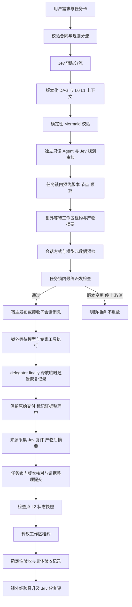
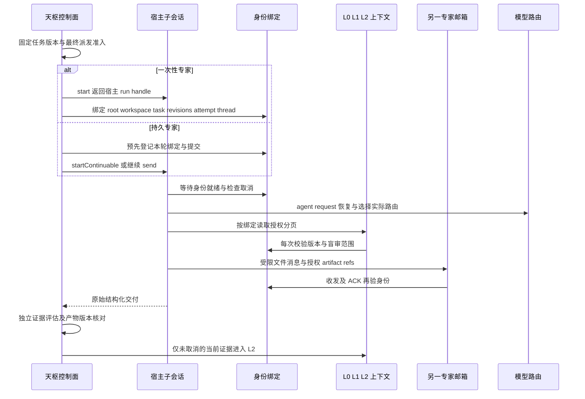

# 百工代码架构、链路与性能审计

日期：2026-10-09。审计基线为 2.3.1 / `e38b0a6fc6ebc20336f70a522b76b7a8af88e7d1`。这次包括源码修复、正反交叉审查、可重现规模基准、真实 Jev MCP 判断及隔离 DSH 回归。不是新的版本发布；运行中的源目录 `lib/`、配置与内存任务没有被候选构建替换。

## 结论与优先级

最重要的发现是三个正确性问题：异步预检后缺少最终派发准入检查、验收与验证的锁顺序形成循环等待、旧根会话快照复活已清除的模型隔离。它们不能仅靠重试、重启或事后标记 stale 解决。本轮已经实施对应修复，并优化可证实的重复扫描和恢复记录滞留。

| 等级 | 已确认问题 | 实施后的行为 / 主要证据 |
| --- | --- | --- |
| P1 | 合同 A 获准后等待文件摘要等操作，delegator 重读合同 B 并给专家建立 B 的绑定；事后才将结果记为 A 的 stale | 固定服务器准入合同；每次 API/native start、持久 start/send 前在任务锁下重验三个版本、当前规划、节点 attempt、停止与取消。拒绝不触发另建会话或换模型重放。`pipeline-atomicity.test.ts` 的延迟摘要竞态及 `delegate.test.ts` 三后端拒绝回归 |
| P1 | experience 开启且 advisory/off 下，模型返回 completed 但仍持有验证租约；Accept 持任务锁申请经验验证租约，与委派最终提交互等 | 独立 `finalization` 状态过滤尚未整理的证据；提前验收 blocked。经验晋升、验收 Jev 移到任务锁外；评分绑定具体验收摘要，拒绝同版本新决定覆盖后的旧回执 |
| P1 | 真实成功只清内存隔离，加载另一个根的旧快照后再次封锁 | 按资源和失败身份持久化成功墓碑；兼容旧数组，保留更新的真实失败与供应商 reset；下一模型请求等待健康提交，10 秒等待超时转恢复，不声称底层写入已取消 |
| P2 | 失败/取消 recovery 与 logical request 在长任务里不断保留 | 委派最终消费结果后释放整组；内部重试继续共享一次 D-ID 的计数；持久专家保留当前恢复/人工选模/暂停。迟到的已取消模型请求被拒绝 |
| P2 | 无限预算预约仍扫描全部历史；状态工具反复复制预算历史比较小配置 | 只有实际启用的正限额才扫描；Jev 不进入限额扫描；缓存小限额签名，变更时仍检查在途预算；单个预约查询不再复制全部历史 |
| P2 | 大正文每次分页重新计算完整 UTF-8 字节数 | 在私有不可变材料上缓存字节计数，每次仍检查授权、修订和摘要；不缓存权限 |
| P2 | 持久专家每次创建预检实例，使元数据缓存失效；共享失败又可能多次增加隔离计数 | 共享有界成功/在途元数据，失败缓存保持局部；相同实际失败按同一健康注册表单飞观察。每次重新检查 owner 健康许可/provider。取消仅结束等待者，不声称 SDK HTTP 已取消 |
| P2 | 评分取消后仍继续采集、循环并发布正常完成材料 | 在采集/文件/来源/判断边界停止；保留实际已发调用用量；外层不发布取消后的 L2、评分及当前完成证据 |
| P3 | P2P retained 满提示归档，但不存在公开归档操作 | 报错明确保留上限、ACK/TTL 不回收、需要宿主维护且未删除引用；pending 满则提示读/ACK 或到期，不虚构可执行命令 |

## 运行逻辑与数据管道

图为规划审核启用时的标准成功路径；Jev 分流可以跳过，advisory/off 下规划审核不是强制执行门禁，原生后端与持久会话分支见模型链路子报告。

`service.ts` 是控制面编排；`delegate.ts` 管理实际宿主会话生命周期；`runtime.ts` 接宿主请求和错误事件；`route-state.ts`/`route-health.ts` 管理恢复、人工偏好和资源隔离。任务 DAG、证据适用性、身份授权、预算、持久化各有独立模块。保留这种职责边界，没有把 Jev 判断替换成硬授权，也没有增加另一套平行编排器。

合同卡/工作流/原始请求各有修订，不能只比较 workflow revision。派发门禁通过可信 `DelegateExecInfo.admission` 传递，工具参数不能提供或覆盖它。锁只跨 SDK 的发布/消息接受，不跨模型结果等待。运行后版本变化仍留下历史交付和 stale 原因，不能把新合同写回旧结果。

`completed` 保留原始模型交付事实；新增可选 `finalization` 为 `processing/ready/cancelled/failed`。只有 ready 或兼容旧记录才可参与当前证据计算。重启遇到 processing 必须转需恢复，不自动重放。状态投影和工具文本展示这一区别。`ready` 表示本轮证据元数据整理完成；磁盘写失败仍由持久层 fail-closed，不把 RAM 状态当作成功落盘。

## 模型与专家上下文链路

详见 [模型路由与上下文审计](./model-routing-context.md) 和 [健康恢复](./route-health-recovery.md)。常规链、灾容升级链和人工选择在请求安全边界合并；额度、池耗尽和认证终态立即选下一兼容路由，瞬时网络故障使用既有有界恢复，上下文溢出只允许有真实 generation 推进的宿主压缩。实际 request/stream-start 可观测本次调用的模型，包括失败请求；只有真实成功的 committed 消息才确认资源恢复，配置链与下一模型选择不冒充已执行。

持久专家只在已见同一任务三项修订时使用简短跟进模板；新版合同重新披露。作者过程与独立盲审隔离；response 阶段必须有冻结初审及匹配产物。P2P 传递不由协调者转发，但发送者和接收者都必须有当前授权，摘要不能继承附件可信等级。

Jev 继续不设插件侧速率、费用或调用预算；网络超时、取消、输入容量约束服务于资源释放和结果真实性。目录预检仅证明可解析与能力兼容，不能证明订阅剩余额度。原生 CLI 内部重试与未报告模型仍为未验证边界。

## 时间、空间与性能取舍

令 N 为单任务历史预约数，A 为一个上下文字节数，P 为分页数，S 为完整状态字节数，H 为健康资源身份数，K 为候选路由数，R 为已经结束的一次性恢复记录数。

| 路径 | 修改前 | 修改后及空间代价 |
| --- | --- | --- |
| 不限额/Jev 连续 N 次预约 | 总 O(N²)，每次临时 O(N) | 总摊销 O(N)；完整历史 O(N) 保留 |
| 正次数/token/费用限制 | 每次 O(N) | 仍 O(N)，只计算启用指标；不引入可能漂移的累计用量缓存 |
| 获取未变预算实例 | 每次克隆 O(N) | 固定配置签名比较 O(1)；变更时仍 O(N) 并检查在途生成 |
| 大材料全部分页 | O(A×P) 重复计数 | 初次 O(A)，之后分页与授权；弱引用每材料一个整数，无正文副本 |
| 一次性恢复保留 | O(R) 累积 | 完成 finally 释放，取决于在途委派与仍活跃持久专家；少量额外生命周期簿记 |
| 同 owner 冷元数据预检 | root 可复用，child 每次重查 | 同一服务、同键、TTL 内单飞；最多 512 元数据项。资格每次独立检查，取消不毒化健康 |
| 规划 K 路由预检 | 串行网络等待 | 并行、按声明顺序收集；无真实生成调用；不会改变回退优先级 |
| 健康持久快照 | O(H)，只能记失败 | O(H) 失败与成功墓碑；联合身份上限 4096，容量拒绝，不遗忘安全水位 |
| 全量状态提交 | O(S) 复制、校验与序列化 | 保留 O(S)，默认 4 MiB。没有删除完整校验或伪称事务为常数时间 |

本地基准每组预热 5 次、采样 30 次。原始 JSON 带环境、SHA、样本和测量口径：

- [预算](./budget-performance.md)：5,000 次无限额 reserve/start/settle，median **1,237.188→46.981 ms**，p95 **1,658.092→87.605 ms**；前后快照字节数相同。
- [上下文](./context-performance.md)：983,040 字节 Unicode 材料、66 页，median **61.256→0.0435 ms**；256 个小材料 retained heap 增量差约 7.5 KiB，属于成本估计。
- [恢复历史](./route-recovery-benchmark.json)：10,000 次失败一次性恢复，GC 后 retained heap 中位 **6,861,432→124,440 bytes**；同步批次 median **99.211→95.959 ms**，p95 **144.733→181.064 ms**，存在以簿记时间换释放历史的取舍，不能声称所有操作都加速。
- [元数据预检](./probe-performance.md)：100 个连续 owner、相同 4 条路由，解析次数 **400→4**，模拟 batch median **221.470→4.054 ms**；并发主要减少查询放大，不能同比推导实际等待。

复杂度表使用主数据尺度描述扫描与复制；canonical JSON 对象键排序另含 Σ k log k 成本，健康恢复的 alias 去重/重建还可能出现二次步骤。因此表中 O(S)/O(H) 不是对任意对象形状和所有内部路径的严格线性承诺。

这些数值不能推导完整任务耗时、token 减少比例或费用节省。NAS I/O、网络、模型生成和完整快照提交仍可能主导实际延迟。

真实宿主首轮还发现了单测未覆盖的兼容性问题：Cordis getter 每次返回不同的追踪 proxy。直接用 proxy 对象身份判断 LLM 服务更换会误拒所有路由。修法仅使用宿主的 `Symbol.for('cordis.original')` 作为缓存身份，实际调用继续经过带上下文的 proxy；真实 target 替换仍失效缓存。单元补多 proxy/同 target 与真更换测试，最终重新运行宿主回归；不把修改测试 fixture 当作修复。

## 正反论证及未采纳方案

正方负责数据管道、预算和元数据热点；反方负责一致性、取消、锁顺序及容量；第三专家独立梳理模型与上下文恢复。互相发送复现证据和反例，最终又补出了“共享失败多次计隔离”“用户已停止仍派发”“同版本新验收覆盖旧异步回执”三项边界，均进入修复。

未采纳：直接在 dispose 清空所有 recovery（会丢失外层尚未消费的 terminal，触发重放）；按 LRU 删除健康墓碑（会复活旧失败）；缓存 owner 授权（会让其他专家越过半开互斥）；吞掉健康提交错误（会静默失去恢复事实）；放宽全状态校验（会隐藏根因）；只提高状态容量或删最大记录（破坏引用闭包）；宣称 Jev 判断或微基准构成正确性证明。

客户端审查未发现本轮必须修复的 React 订阅失稳：已有 stable subscribe/getSnapshot。2 秒轮询与 catalog 请求仍有后续合并空间，需在真实交互证据下处理新旧响应/CAS，避免单为减少请求让命令后视图过时。本轮没有修改客户端行为。参考 React 官方 [useSyncExternalStore](https://react.dev/reference/react/useSyncExternalStore)；TypeSafe 的判断语义参考[官方文档](https://docs.typesafe.ai/llms.txt)。

## 验证记录与运行边界

**最终验证：64 个单测文件、765 项通过；6 个真实 DSH 宿主测试文件、32 项通过；类型检查、私有候选构建与 diff 检查通过；官方 Mermaid 11.12.0 解析 3/3 通过。** 首轮候选测试因 Cordis proxy 身份误判出现 12 个失败，修复后完整重跑全部通过，初轮没有算入通过结果。

最终测试清单、真实 Jev 结果和构建源指纹见本目录 `verification.json`、`jev-review.json`。所有派发竞态测试使用延迟门闩和假宿主；隔离 DSH 测试使用真实 0.2.0-rc.2 宿主和本地受控模型，不消费 Claude 订阅。候选编译到 `/tmp`，通过 `SWARM_PLUGIN_ROOT` 让沙箱加载，不覆盖生产 `lib`。

[长任务容量反馈](./capacity-feedback.md) 仍有未实施的产品化边界：全状态 4 MiB、上下文 512 项、P2P retained 2048，以及大量空目录的遍历成本。健康事实当前在各已加载根的完整状态中重复保存；严格共享提交栅栏的取舍是任一根持久失败可暂停整个 profile 的新模型请求。未来独立 canonical health store 可减少多根复制与故障连带，但需要单独迁移和恢复设计，本轮未引入。

未来需带引用闭包、校验和 CAS 的归档与 I/O 访问上限设计；本轮不保证无限运行，也不声称当前生产任务发生了这些容量案例。
