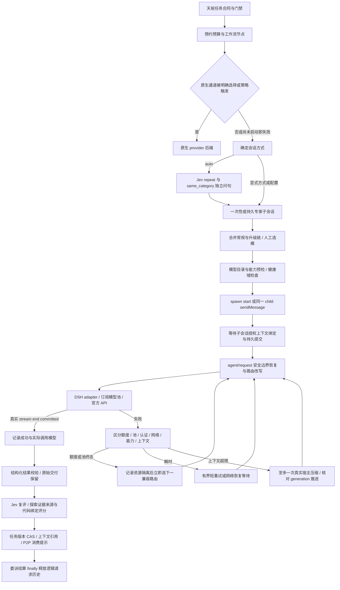

# 模型路由、恢复与专家上下文审计

日期：2026-10-09。基线提交：`e38b0a6fc6ebc20336f70a522b76b7a8af88e7d1`（2.3.1）。本次审计和合成试验未启动 DSH、未调用 Claude/ChatGPT 生成模型、未读取生产凭据或对话正文。

## 实际调用路径

角色包括天枢和 12 个可委派角色，共 13 个角色；算衡 research/verify 的模型链不同，合计 14 个路由键。`runtime.ts` 挂在角色预设上，生成请求改写和错误恢复在 `route-state.ts`；原生 Codex/Claude 后端不是普通 API 路由，因此其内部重试与真实模型不可观测时必须标记 unknown，不能用配置名称代替实际执行证明。

`routes.ts:intRouteProbe` 只检查 provider、模型目录、推理强度与图片能力，不执行生成调用，也不证明账户额度仍可用。`agent/assistant-stream` 的 start 与 committed assistant/message 才构成真实请求开始与成功观察。`model/selection` 表示人工选择；自动 fallback 写入 request/header 不改变人工偏好。

## 专家上下文与数据绑定

- 一次性专家由宿主提供 `structured_output`；持久专家用最后一条 JSON 交付，Schema 会重复近距离提示。持续会话只有已见过相同 task/card/workflow/request 修订时才省略完整合同；变更后重新披露。
- 子会话通过真实父子关系和 `features.bindings` 获取 root/workspace/task/card/workflow/request/node/attempt/thread 绑定。原始对话留在宿主；插件上下文按引用授权分页读取，专家间文件消息由受限邮箱直达。
- 独立盲审禁止读取作者过程及既有评分；response 阶段另行验证冻结初审、版本和产物。模型家族差异是辅助独立性信号，不能替代真正盲审。
- `tan_wei`/`bo_wen` 评分读取实际源码与来源，分别判断 credibility、relevance、support；上下文/P2P 消费再次检查绑定、时效和文件指纹。消息摘要始终不能继承附件的可信等级。
- 当前 Jev 复评仅对有界摘要作语义提示；截断的验收项或原始结构不能据此宣称完整事实验证。评分浓度不是事实正确率，确定性门禁由代码控制。

## 正反论证后的发现

### R1：失败恢复历史随长期运行累积，已修复并定向验证

原 `logical` 为进程级 Map；仅成功时将 completed 项清到 1024，失败、取消及终态项不参与回收。`recoveries` 也未在 DelAgent/ReleaseAgent 删除。因此大量失败子会话和 root 失败 steps 的保留内存与历史次数线性增长。

直接在 DelAgent 删除 recovery 是错误修法：一次性委派在 dispose/end 后才读取 terminal，以阻止额度或健康提交错误引起外层自动重启。反方确认必须保留这一时序。

修复将请求状态按委派 D-ID 分组，并新增 `FinishLogicalRequest(D-ID)`：内部重启共享同一步的八次 admission 计数；owner 在结果消费后的 finally 释放整组失败/取消历史。普通 root 只保留当前 step；持久专家保留当前 recovery、人工选模和暂停栅栏。旧无 D-ID 的 DelAgent 接口仅保留最多 1024 条轻量终态回执。当前同一步的迟到重复事件仍复用计数。

主服务接线必须覆盖普通委派、独立规划 reviewer 的 plan-UUID，以及冷恢复元数据注册；取消后尚未真实沉寂的旧请求还须由 abort/暂停栅栏拒绝，不能把 interrupt ACK 当作已停止。定向测试包含这些生命周期机制的单元部分，生产调度约束由对应服务集成测试核验。

### R2：成功后旧根会话快照可以恢复过时隔离，已修复并定向验证

`health.succeeded` 删除内存失败记录，但恢复合并没有成功水位；另一根会话旧状态随后加载会重新加入已清除条目。合成案例：quota 未提供 reset，插件 retryAt=1800000；5000ms 用户 force 半开调用真实成功，available=true/entries=0；加载旧 snapshot 后 available=false/entries=1，又隔离近 30 分钟。普通等冷却到期再成功的场景主要造成重复半开竞争；提前成功的手动恢复会直接重新封锁。

修复增加逐资源因果成功水位，结合 failureId 与每资源单调 failedAt 拒绝旧失败快照，并保留更新的真实失败及供应商 reset floor。快照升级为 `{schemaVersion:1,entries,cleared}`，兼容旧数组；持久快照排除 live half-open owner。资源键与成功水位合计最多 4096，不用 LRU 逐出成功水位后允许旧故障复活；容量不足须明确恢复处理。

真实成功由 emit-only stream 事件同步观察，后台提交成功水位；提交失败记录受控异常反馈。采用 profile 共享的 durability barrier，任何 managed agent 的下一模型请求均通过 `WaitHealthReady` 等待，默认总计最多 10 秒或调用方取消；更新的完整快照可以覆盖旧提交失败，但不能重新启动等待计时器。超时暂停本次模型请求，明确底层写入仍待确认，不能宣称写入被取消。提交失败后，后续合法恢复请求先重提当前共享健康快照，提交成功才可调用模型。原 child Finish 不删除共享提交，迟到拒绝仍阻止其他 agent 获得新模型调用，并且不回建已结束委派的幽灵记录。取消/超时从等待者集合移除，不向长期未决的写入 Promise 无休止追加回调。

这是明确的持久一致性取舍：现有 hook 写入所有根会话，因此一个根会话的提交错误会暂时暂停整个 profile 的新模型请求；已提交的真实 assistant/message 不会被改称为模型执行失败。后续应将健康事实迁移到独立 profile canonical store，以隔离坏根会话并减少复制，本轮不临时引入存储迁移。

只对新 success 写一个根会话快照不能根治其他根的旧复制品，因此成功水位和持久化门禁缺一不可。本次先以现有发布 lib 纯合成复现，再以更新源码定向验证，没有实际模型调用。最终冻结版本 route-state 60 项、route-health 25 项合计 85 项定向测试通过，覆盖跨 agent barrier、Finish 后迟到拒绝、新快照覆盖旧失败及总等待期限；全仓和宿主验证以主审计报告为准。

### R3：持久专家预检每次重建缓存，已修复并交叉审查

`service.ts` 的 `probeForChild(childId, route)` 每次调用都创建新的 `intRouteProbe`，因此 120s 成功缓存、15s 失败缓存和同键并发复用全部失效。模型目录预检又依次调用 resolveModelInfo 与 resolveCallConfig，后者可能重复解析目录。普通共享 `probe` 已有复用能力，持久专家路径没有。

本次共享不含 owner 身份的目录/能力缓存，成功结果保留 120 秒，同键未决 lookup 共用，容量 512；失败只在独立 probe 内短时保留，避免新人工恢复重放其他 owner 的旧失败。资源健康和手动半开许可仍按 child 在预检前后检查，LLM 底层实例替换和 provider 移除另行重验；Cordis 的不同追踪 proxy 仅以 `cordis.original` 对应的真实实例作身份，实际调用仍走当前 proxy。key 包含 wire effort 和能力/策略含义；取消只结束当前 waiter，不能冒称 SDK 请求已停止。

正反复核发现一个新放大边界：同一共享 metadata failure 被多个独立 child probe 消费时，会重复更新资源失败次数，使冷却指数放大。已通过 service 共享的 `createRouteFailureObserver` 去重同一个真实 failure 对象；不同 service/健康 registry 保持独立观测，持久提交拒绝也向所有对应等待者传播。不能直接把一个 child 的 owner health 判定共享给其他 child，否则会绕过单半开互斥。

### R4：元数据尾延迟与健康持久化放大，暂列后续优化

独立 planning reviewer 的候选预检原为串行，本次已改为保序并行；普通委派已有并行路径。resolveModelInfo/resolveCallConfig 没有插件可用的 AbortSignal 合同，首次共享等待固定最多 30 秒，超时只结束等待并保留 SDK 在途槽；后续相同未结束目录立即返回 timeout，真正晚完成可恢复缓存，不重复堆积后台请求。Promise.all 在此界限内仍受最慢目录影响；取消可以停止本次等待，但不能声称底层 HTTP 已被中止，也不能把这种元数据取消实现成生成模型的强制超时。

`onHealthChange` 当前把共享健康状态写入所有已加载根会话的完整快照，故障提交成本与全部根状态总量相关，任一持久化错误会停止此次恢复。可研究独立 profile 级健康存储和合并写入，但必须保留隔离提交先于恢复动作的约束，不能简单吞掉提交错误。

## 时间与空间复杂度

令 R 为一条常规/升级候选链长度，T 为根会话持久专家数，D 为任务委派记录数，C 为有效上下文数，S 为待提交完整状态字节，A 为活跃委派数，L 为活跃委派保留的 step 数。

| 路径 | 时间 / 等待 | 空间与权衡 |
| --- | --- | --- |
| 普通 FindUsableRoutes | O(R)，外部预检并行，尾延迟受最慢候选影响 | O(R) Promise；通常角色候选很少 |
| 单次 fallback 选择 | O(R)，需预检时按候选顺序等待 | 保留 tried 集合，禁止同逻辑请求绕回 |
| health admission | 路由/domain/pool 键数固定，平均 O(1) | 单半开互斥；record/restore/list 有资源数量相关成本 |
| 持久专家候选选择 | O(T log T)，扫描筛选后排序 | history 限 5，但 registry 无已关闭条目淘汰；可先改 O(T) 求最近匹配，再考虑归档 |
| 评审家族过滤 | O(D) | 历史委派保留以供审计，不能直接丢弃 |
| 完整 health 复制提交 | 近似 O(所有根的 S 总和) | 多根复制，对提交一致性要求高 |
| 修复前 recovery registry | 保留失败历史 O(累计请求/step) | 仅成功清理无法解决失败历史泄漏 |
| 修复后 recovery registry | root 新 step O(1)；Finish O(本委派 step+关联 child) | O(L+持久/当前 agent+至多1024旧接口回执)，不再保留已结算委派失败历史 |
| Jev | 每项窄判断外部调用；独立问句已同请求并行 | 用户明确不限流、不设预算；本地资源采集仍需有界 |

微基准不是端到端耗时、订阅用量、token 节省或 NAS I/O 基准。生命周期账簿带来额外同步操作；优先保证失败历史可释放，不能声称所有路径都提速。可复现命令与数据见 `scripts/bench-route-recovery.mjs` 和同目录 benchmark JSON。

最终 30 样本、5 次预热、10000 次合成循环结果如下；旧/新版本使用相同的既有编译依赖，在独立 Node 进程里读取可信源码并于内存中去除 TypeScript 类型，没有构建或加载生产插件。数据文件包含源码/依赖摘要与每个样本原值。

| 场景 | 保留 heap 中位数，字节，旧→新 | 同步循环中位耗时，毫秒，旧→新 | 同步循环 p95，毫秒，旧→新 | 新版可达恢复状态 |
| --- | --- | --- | --- | --- |
| 失败一次性委派 | 6861432 → 124440 | 99.211 → 95.959 | 144.733 → 181.064 | 0 agents / 0 scopes / 0 steps |
| 取消一次性委派 | 6438728 → 112584 | 41.872 → 45.815 | 65.180 → 77.501 | 0 agents / 0 scopes / 0 steps |
| root 失败 steps | 4497048 → 114328 | 76.459 → 80.616 | 139.660 → 138.243 | 1 agent / 1 scope / 1 current step |

中位耗时有升有降，尾时延也可能上升；额外生命周期记账换取了已结束失败请求可确定释放，没有统一提速的结论。GC heap 差值存在噪声，不代表生产峰值内存，也不代表模型响应时延。持久 ThreadRegistry 和历史委派仍保留审计记录，关闭线程/旧任务归档与完整状态容量是后续架构议题，不能因此承诺无限运行且永不触及状态容量。

## Skills、MCP 与外部依据

本审计应用 `typesafe-ai` skill，读取当前官方 [HTTP API](https://docs.typesafe.ai/api.md)、[confidence](https://docs.typesafe.ai/confidence.md) 与 [文档索引](https://docs.typesafe.ai/llms.txt)。接口返回 typed questions 对应 answers；Choice/Score confidence 由分布计算，不是系统正确性证书。官方建议将相互独立、读取同一状态的问题同请求发送；有数据依赖时才另开请求。

真实 `jev_health` 成功，真实 `jev_check` 对公共代码事实的初步判断：失败历史可无界保留 0.87；“直接删除 recovery 而不改终态读取仍安全”0.27；需要分离终态消费与清理 0.75。它们是模型对 supplied state 的判断概率，结论依赖可复现单元测试和具体代码审查，不构成正确性证明或生产准确率标定。

另一次真实 `jev_check` 对健康恢复设计的独立判断：因果成功水位与持久快照解决旧失败复活 0.79；“仅保存当前 root 即足够”0.14；“等待超时即底层写入已取消”0.09；更新真实失败与供应商 reset 必须保留 0.91。该判断使用公共代码事实和合成复现状态，未发送生产上下文、凭据或账户数据。
