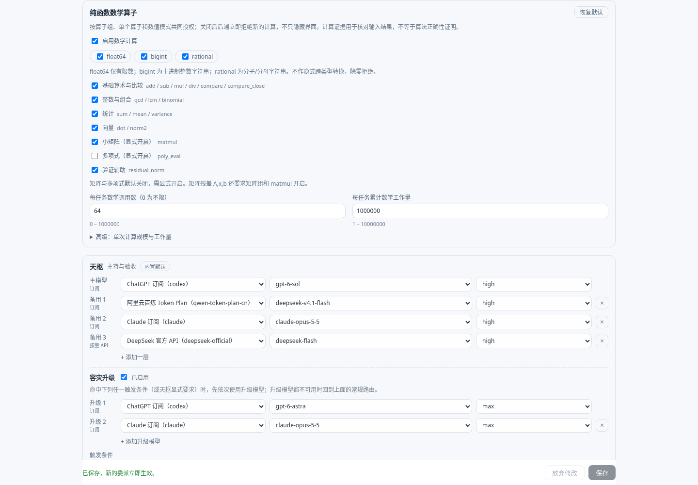
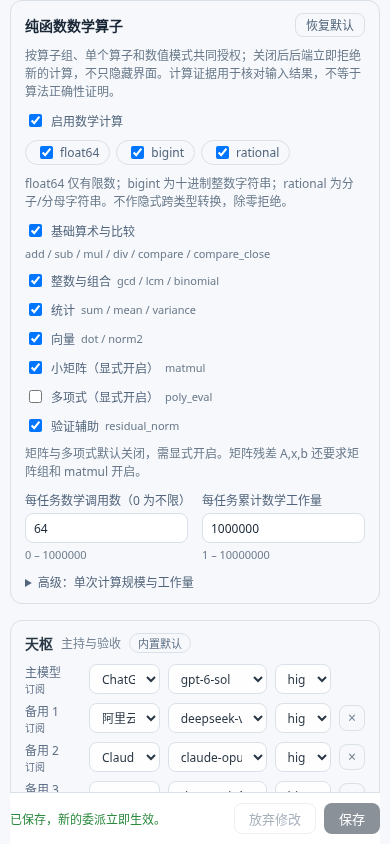

# 2.4.0 额度与纯函数配置验证

额度仅用于真实 Agent 调用中的自动模型链选择，不在设置做额度可视化；本轮直接读取当前宿主/订阅插件公开返回值，不建立估算额度表。已安装subscriptions 0.9.8只公开部分订阅提供方的百分比窗口；采样时间、未能证明的模型池映射和Qwen/Go/DeepSeek/Jev额度接口未公开时保留unknown。按量API没有订阅窗口不表示余额无限。

- [来源契约](./quota-source-contract.md)：正式RPC、缓存反例、窗口/账号关联、容量与性能。
- 自动调用：只有完整可证成员全部上报100%时，在连续订阅段内软排序；未知保持原链，延期订阅仍在API前，人工选择、首选恢复及真实成功受保护。没有新增额度查询工具，额度事实不污染任务合同或数学预算。
- [完整调用链审计](./runtime-audit.md)：运行、数据、模型、专家上下文、异常回退、时间/空间复杂度与清理边界。
- [额度 CPU 基准](./quota-routing-performance.md)：受支持的合成目录 p95 438.558 → 7.231 ms，不能推导生成模型端到端提速。
- [数学实现](./math-settings.md)：7组/17算子/3模式、边界、稳定算法、计算证据版本2。
- [正反交叉审核](./adversarial-review.md)：反例、采纳修复和保留限制。
- [实施方案与流程图](../../superpowers/plans/2026-10-09-v2.4.0-quotas-and-math-settings.md)。

已执行的受控浏览器检查：矩阵默认拒绝且预算为空；显式打开保存后真实计算成功；重载保留配置；关闭matmul后矩阵和组合残差均拒绝且预算不增；多项式显式打开计算17；累计工作量0阻止保存并显示错误。1440px桌面与390px窄屏无页面水平溢出、无浏览器错误。

下面截图只展示临时数学任务的配置，使用真实宿主React与候选真实SwarmService，不包含生产账号或真实额度。

全量测试、源文件指纹、生产升级、真实来源对照与GitHub资产结果以本目录最终验证记录和Release manifest为准。Jev概率不构成正确性证书；当前正式接口不支持的供应商不宣称实时精确额度。

技术参考：[React useSyncExternalStore](https://react.dev/reference/react/useSyncExternalStore)、[TypeSafe 官方文档](https://docs.typesafe.ai/llms.txt)。

最终验证：**859 项单元测试、38 项真实 SDK 集成通过，类型检查通过**。本机单一 systemd 服务已从 2.3.2 升至 2.4.0，内存交接仅消费一次，整份状态提交成功，历史交付和已消耗预算保留。真实来源对照 30 个返回窗口完全一致，匿名访问诊断接口为 401。原任务规划审核仍 unavailable，维护验证不授予业务执行权限。

证据：[完整验证清单](./verification.json)、[生产核对](./production-check.json)、[最终 Jev 路由复审](./jev-final-routing-review.json)。早期 jev-review.json 属于设计阶段的辅助判断，最终自动路由范围以最终复审记录为准。
