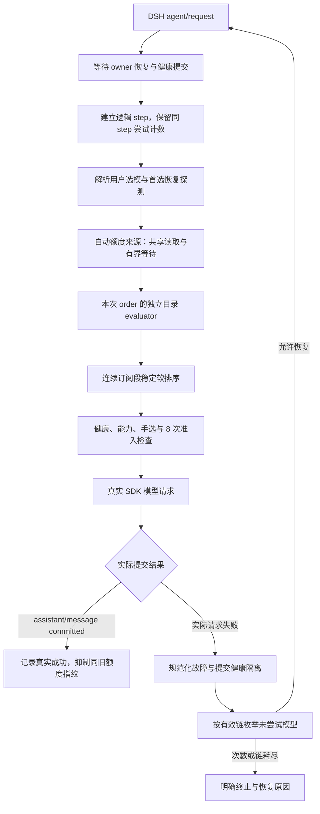
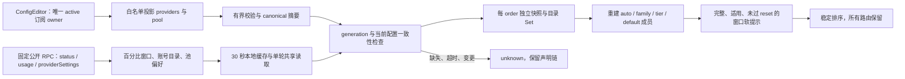
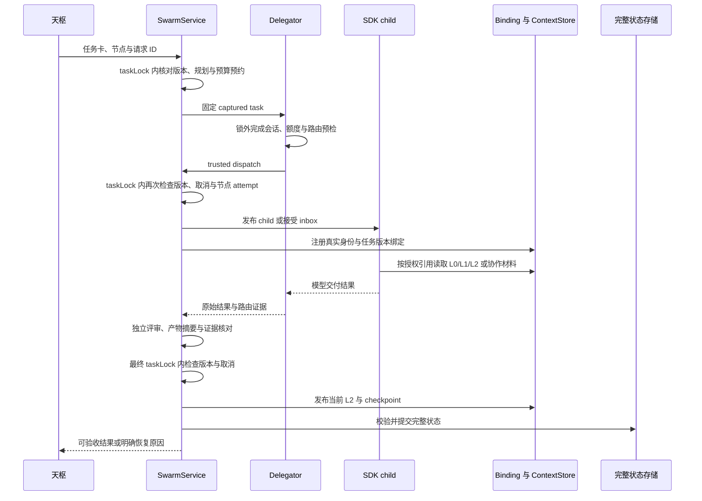

# 2.4.0 全链路运行、性能与清理审计

2026-10-09。反方独立审查最终源码候选，范围为额度来源、实际模型选择、专家委派、恢复与取消、上下文/状态以及数学预算。实现问题与互驳历史见[反审记录](./adversarial-review.md)；供应商契约见[来源说明](./quota-source-contract.md)。本报告补充跨模块调用关系与性能边界，不重述全部修复过程。

本轮反方结论：已检查的代码链路没有未解决的发布阻断项。来源未知不作额度硬排除，100% 上报值只在完整证据条件下影响软排序；人工选择、健康隔离、任务准入、恢复次数和数学累计预算保持各自权威。以下图示为代码调用关系；实际任务准入仍使用结构化 DAG、版本绑定和规划审核。

## 运行与模型调用链

入口：[index.ts](../../../src/index.ts) 装配共享额度 source，传给 [service.ts](../../../src/service.ts)；[runtime.ts](../../../src/runtime.ts) 的真实 `agent/request` 以及 [delegate.ts](../../../src/delegate.ts) 的子智能体预检自动调用它，没有要求主持模型自愿查询额度。



关键不变量：

- `PrepareQuotaRouting` 覆盖首次 root；child 创建前已有额度排序时，真实创建的 `initialRoute` 保持不变，只安装完整有效回退链。元数据探测、能力、视觉要求与任务授权继续生效。
- 排序只在连续 subscription 段内稳定调整。unknown 与已报告余量保持原顺序，不比较不同套餐的百分比大小；后移的订阅仍在该段原本后面的 API 前尝试。人工明确选模、`rootFallback=false` 和首选恢复 trial 受保护。
- 实际故障按既有 health 规则隔离。额度缓存不能清除隔离、扩大 quota domain、伪造 half-open 成功或新增硬拒绝。
- 有效回退链按未尝试集合从头枚举，避免初选 B 后按旧 index 跳过被后移的 A。逻辑请求准入上限仍为 8，不因排序、同请求重启或元数据读取重置。
- source 辅助成功回调只在宿主实际提交 `assistant/message` 后运行。`assistant/attempt`、元数据预检成功和“有额度”提示都不构成模型实际成功。
- 相同升级链与相同有效 policy 的刷新保持对象和恢复时钟。真实链变化、policy 变化、完整链语义变化、人工选择、dispose 会使旧准备或旧探测失效。

源码位置：[route-state.ts](../../../src/route-state.ts:417)、[自动准备](../../../src/route-state.ts:686)、[升级刷新](../../../src/route-state.ts:760)。本轮重新核查了 `completeChain` 从 false 变 true 的分支；它已清除旧额度顺序和准备记录，无需额外修改。

## 额度数据管道与生命周期



[quota.ts](../../../src/quota.ts) 只使用正式只读 RPC。状态一轮读取一次，usage 每账号一次。账号与窗口用 opaque ID 关联，不相加不同账号或全局/scoped 窗口；独立模型 ID 中的账号身份不向诊断回显。正式 carrier 白名单为 status、usage、providerSettings；公开诊断 `swarm.quotaView` 仍由宿主 HTTP 认证保护。

[quota-routing-source.ts](../../../src/quota-routing-source.ts) 的调用等待参数上限为 1 秒；超时保留声明链，共享后台读取可以继续到 30 秒期限。取消一个等待者不意味着订阅插件内部 HTTP 已被取消。source 校验读取前后的配置摘要与 generation，旧配置结果不会发布到新缓存；invalidate 同时失效 reader 本地缓存。

[quota-routing.ts](../../../src/quota-routing.ts:255) 的 evaluator 每次 order 创建一次：构建每 provider 的目录 Set，复制本轮必要快照，随后所有 route 复用这些目录。它没有全局资格缓存；下一次 order、配置变化或新请求重新建立 evaluator。完整源数据缓存与本次资格计算的寿命分开。

当前 subscriptions 0.9.8 的 usage 仍可能返回 lastSnapshot，未公开 sampledAt 或 stale 标记。读取时间、成功强刷、窗口百分比均不足以证明实时资格。只有完整可证成员各有适用 100% 且未到期 reset 窗口时，才产生 soft-defer；`eligibility` 保持 unknown、`hardSkip=false`。partial、缺失 owner、账号目录不一致、未知别名、无截止的满额、过期窗口和资源策略冲突都为 neutral。

实际成功保护使用成员、适用窗口数值/reset 和配置指纹；读取时间、派生 hint 与无关 provider 不进入指纹。冷恢复不恢复额度权威。当前 DSH 没有公开 Qwen/Go/DeepSeek/Jev 通用额度接口时，这些来源维持 unknown；按量计费不表示余额无限。

## 委派、上下文与状态提交



任务锁在真正发布前重新检查 captured 合同、原始请求、规划、节点 attempt 和取消状态，避免额度/模型预检等待期间任务改版后仍启动旧授权。发布锁等待 SDK 的 handle/inbox 接受，不等待完整模型结果。已发布工作发生取消时保留已发送消费与未知副作用状态，不自动重放写任务。

模型完成不直接等于可验收完成。`finalization:'processing'` 期间材料不能作为当前完成证据；评审、后摘要、版本与取消检查之后才发布 ready。只读投影不能修复私有状态或绕过门禁。接受任务后的经验晋升等外部等待保持在任务锁外，避免验证租约与任务锁循环等待。

L0 合同、L1 来源、L2 计算/交付证据都由真实 root/workspace/task/版本绑定授权。分页每次继续检查身份、版本、摘要和 blind-review 限制；UTF-8 字节长度缓存只优化派生数据，不缓存授权。专家上下文和消息引用不因模型路由改变而放宽。

额度缓存、目录 evaluator 和成功软提示全部是短期派生状态，不进入任务合同或规划摘要，不修改 workflow revision，也不写入永久健康墓碑。数学预算与上下文/任务状态仍按原持久化规则恢复。

## 数学执行与预算

入口为 [Calculate](../../../src/service.ts:1145)。锁内重新检查取消、当前身份/版本和最新数学配置；组、单算子、数值模式共同授权。拒绝的权限调用不预占预算。任务剩余工作量为零时在核执行前明确拒绝。

执行顺序为：`min(单次上限, 任务剩余)` → 预占该 hard upper → 同步纯函数核 → settle 实际 workUnits → 有界 L2 证据 → 完整状态提交。预占上限不是实际消费；失败和重启不能把已经执行的工作量退还。线上调低限制保持历史消费，不能通过配置变更重置预算。

[数学核](../../../src/math/operators.ts) 保持无 I/O、eval、随机与输入修改。矩阵全部乘加/归约费用在输出循环前检查；组合残差还要求 matrix/matmul 权限。均值优先 Neumaier，只有中间 NON_FINITE 时缩放回退；方差采用移位/缩放的稳定计算。输出 `operatorVersion=2` 与 computed 证据，不升级为一般证明或算法正确性结论。

超限等失败只保留有界 op/mode、失败结果和原输入省略声明，避免把核已拒绝的巨大 raw 再写入完整状态。成功输入仍按输入/输出边界保留可复现计算材料。

## 时间与空间复杂度

记 P 为订阅提供方数（至多 5），A 为账号总数（至多 128），C 为目录里的模型项总数，R 为本次路由项数，M 为单 route 成员数，W 为保留窗口总数（至多 1024），S 为完整状态字节数，B 为读取/散列的文件总字节数。数学 n 为向量长度，m/k/n 为矩阵维度，b 为整数位长。以下均为本地代码成本，不包含供应商网络和生成时间。

| 路径 | 时间 | 额外空间/边界 |
| --- | --- | --- |
| 公开 quota 归一化 | O(A+W_seen)；窗口 ID/hash 计入输入长度 | O(A+W)，每账户检查至多 128 个窗口；超限明确 unknown |
| 单 order 目录构建 | O(C+A²)，账号交叉核对仍有线性匹配 | O(C+A)，Set 只活在该次 evaluator 内 |
| route 成员/窗口判断 | 保守 O(R·(M·A+W+R))，另有成员/窗口指纹排序 | O(R·M+W+C) 加快照；没有宣称整条判断是 O(R) |
| 稳定订阅段重排 | O(R) | O(R)，不删除候选、不跨 API/受保护边界 |
| 有效顺序校验/回退匹配 | 当前 permutation 与索引匹配最坏 O(R²) | O(R)，默认链短；自定义长链仍有成本 |
| metadata 预检 | 缓存命中近似 O(1)，冷态依赖 SDK 网络 | 默认共享容量 512；挂起 lookup 有等待边界，取消等待不证明 SDK I/O 停止 |
| task 状态提交 | 至少 O(S)，完整 clone/canonical/schema/编码有常数遍开销 | O(S) 派生副本；4 MiB 状态与 64 MiB journal 上限仍在 |
| 授权上下文分页 | 当前页切片成本；每次身份/版本核对 | 字节长度 WeakMap，材料总量最多 512，单材料最多 1 MiB |
| 文件摘要/证据核对 | O(B)，证据摘录仍按实际文件读取 | 受路径与来源约束；大仓库 I/O 成本仍存在 |
| sum/mean/variance/dot/norm2 | O(n)，mean 溢出回退至多增加常数遍扫描 | 输入副本 O(n)，方差/回退使用有界临时数组 |
| matmul / A,x,b 残差 | O(mkn) / O(mk) | 输出 O(mn) / O(m)，输入/临时向量另计；维度与乘加上限先检查 |
| poly_eval | O(n) Horner | 核标量工作空间 O(1)，输入/摘要 O(n) |
| BigInt/有理数 | 取决于引擎乘除复杂度 M(b)/D(b)；Euclid 多步 | 有输入、输出和中间位长边界；不能把一次 opcode 当作恒定 CPU 成本 |

同 order 复用目录消除原先每 route、每成员反复构建 Set 的热点，旧路径最坏包含 O(R·M·(C+A²))。它保留账号核对和全状态校验，换取有界的本次 Set 空间，不引入跨请求资格缓存。

自动来源还可能并行进行目录 RPC 与 usage RPC：usage 全 provider 合计并发上限 4，目录读取另有上限 4。第三方 providerSettings 内部的目录/元数据 fan-out 由上游实现负责，不能把本层两个队列描述为所有内部 HTTP 总并发只有 4。

## 可复现性能与真实性边界

[CPU 基准](./quota-routing-benchmark.json)由 [bench-quota-routing.mjs](../../../scripts/bench-quota-routing.mjs)执行，Node 24.21.0，5 次预热、30 次样本。每次包含 evaluator 构建与整批 route 计算；优化前后逐字段输出等价。没有调用模型、CLI 或生产服务。

| 合成规模 | 单 provider RPC 字节 | 未复用目录 median / p95 | scoped evaluator median / p95 |
| --- | ---: | ---: | ---: |
| 2 账号、64 模型、13 route、每池 2 成员 | 4,753 | 1.406 / 1.942 ms | 0.644 / 1.737 ms |
| 32 账号、256 模型、32 route、每池 16 成员 | 305,393 | 357.091 / 438.558 ms | 5.434 / 7.231 ms |
| 32 账号、512 模型、32 route、每池 16 成员 | 616,689 | 820.726 / 1,065.750 ms | 5.856 / 11.976 ms |

第三行超过当前 512 KiB 单 RPC 上限，只是算法压力样本；真实 source 会将超限响应降为 unknown，不能用它宣称生产可达场景提速。第二行处于当前 RPC 边界内，证明目录热点优化有意义；小规模 p95 差异较小，不能宣称每个请求均有同等收益。

基准没有测量完整 Agent 端到端延迟、供应商 RTT、token 节省、峰值 RSS 或跨硬件 SLA。1 秒/30 秒是等待策略参数，JavaScript 事件循环负载会影响实际唤醒时间，不是硬实时保证。本轮没有通过消耗 Claude/ChatGPT 订阅生成来证明调用可用性；真实源读数、真实宿主回归和升级结果由最终验证记录分别说明。

## 本轮清理与保留风险

已完成的代码清理：

- 移除不再符合最终需求的额度设置卡片、QuotaController、客户端包裹/导出与展示原型测试；不注册额度查询工具。保留实际自动 source 和有维护消费者的 `swarm.quotaView` 诊断 RPC。
- 预览统一为 [preview-math-settings.mjs](../../../scripts/preview-math-settings.mjs)，移除无消费者的假额度 endpoint、import、计数器和提示，保留真实候选数学服务及设置验证。
- 升级链 policy 相等判断复用 `getCanonicalJson`，source 配置投影摘要复用 `getValueDigest`。白名单/大小校验仍独立保留，因为它们承担授权与资源边界，不能用通用序列化替代。
- 一次 order 只创建一次 `createQuotaRouteEvaluator`，目录整理不再逐模型重复；独立 helper 仍供测试、基准与复用调用，不作为死代码删除。

这是一轮有范围的清理，没有宣称全仓库死代码、重复代码或所有性能热点已经清零。

保留的架构风险：

1. 供应商采样未知使软排序存在假阳性。成员映射依赖当前公开契约；上游变更、未能证明的 owner/别名/目录必须退回 unknown。
2. 原生 CLI、订阅模型池内部重试/成员尝试不是全部暴露为 SDK logical admission。8 次约束不能表述为外部 HTTP 总请求一定不超过 8。
3. 全状态提交、文件摘要和任务锁仍会产生串行与 I/O 成本。合法大材料、长会话仍可能达到 4 MiB/512 材料边界；失败材料缩减不等于无限证据留存或完整容量事务重构。
4. metadata 的挂起 I/O、后台 quota 读取和第三方 fan-out 不一定响应调用方取消。当前取消保护的是准入/等待和旧结果发布；生产部署仍需保全 memory-only owner 后更新唯一服务。
5. 数学是 binary64 或有界精确整数/有理数计算，有限结果与小残差不构成一般证明；工作单位是本地确定性计费规则，不是纳秒、token 或订阅额度。

## 独立验证记录

最终 scoped evaluator 接线后，反方独立执行：

```text
npx vitest run tests/unit/quota.test.ts tests/unit/quota-routing.test.ts \
  tests/unit/quota-routing-source.test.ts tests/unit/route-state.test.ts \
  tests/unit/delegate.test.ts tests/unit/pipeline-atomicity.test.ts \
  tests/unit/task-runtime.test.ts tests/unit/math-config.test.ts \
  tests/unit/math-operators.test.ts tests/unit/context-store.test.ts \
  tests/unit/state-store.test.ts --reporter=dot
11 files / 267 tests passed

npm run typecheck -- --pretty false
exit 0
```

覆盖 source 共享/过期/取消/成功保护、成员映射、实际 runtime 初选、回退与恢复计数、可信发布准入、L2/状态一致性、数学权限与冷恢复预算。历史反例和修复后的正向测试均见[反审记录](./adversarial-review.md)，重复运行数量未累加为唯一测试数。

本报告完成时只做源码读取、测试和文档语法验证，没有构建或改写生产 `lib/`。最终全量、私有候选真实宿主、浏览器、本机升级和发布工件证据由主审验证记录及 release manifest 汇总。

本文 3 张 Mermaid 图均通过当前锁定的官方 parser 11.12.0，使用已有 parser 的独立 worker/DOM 适配读取文档源码验证；未修改宿主全局 DOM。语法通过只证明代码书写可解析，调用关系结论另由上述源码与回归支持。
