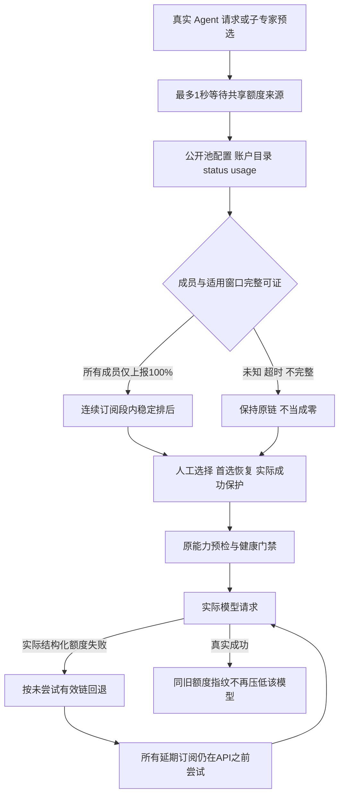
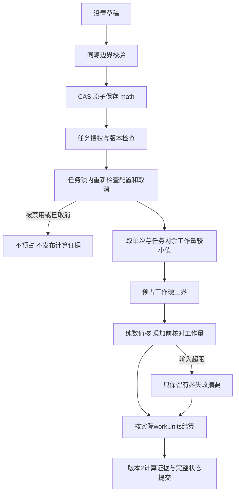

# 2.4.0：真实额度来源与纯函数配置实施方案

基线 2.3.2；目标 2.4.0。已由额度/接口正方、数学/工程正方和统计/架构反方独立核查并互驳，结论以当前已安装 DSH 0.2.0-rc.2、subscriptions 0.9.8 的公开契约为准。

## 额度事实与可用边界

最终按用户修正：额度进入实际root/child模型链自动选择，不在设置做额度可视化，不注册让LLM自行选路由的额度工具。设置仅保留数学配置。

数据从订阅插件正式status/usage/providerSettings只读RPC取得；ConfigEditor.entries只投影唯一active订阅插件的providers/pool字段，结合公开账户目录及pool偏好证明成员，不读取auth store、私有缓存、凭据或完整插件配置。采样时间未公开，force失败可能返回旧快照；读取时间不冒充采样时间，短期窗口不假定恰好5小时。Qwen/Go/DeepSeek/Jev未公开统一额度/余额接口时保持unknown，不从价格、context/maxTokens、本地调用数或会话token估算，API无窗口不等于无限余额。

额度来源后台共享30秒读取/缓存，usage合计并发4，目录读取另设并发4；不将第三方内部HTTP fan-out视为这两个队列的总量；数据源超时或失效不阻断正常尝试。未知采样不能hard skip，也不把100%写成永久隔离；仅完整成员一致报告满额时生成软偏好，不比较不同套餐百分比大小。当前上游95%只是最后尝试排序，不是硬排除。本插件不改第三方门槛。

原声明链保留首选偏好，单step有效链用于自动初选及失败回退；不能在先选B后用旧index+1跳过延期A直接API。人工选模和首选恢复试探受保护，实际成功压过同一旧缓存指纹，8次逻辑尝试/取消/不重放副作用保持。额度状态不写L0、planning snapshot、workflowRevision、health墓碑或数学预算；冷恢复重新未知。诊断RPC只用于维护与真实源值对照，不提供设置可视化。

## 数学配置与执行

新增7组、17算子（保留已有compare）、3数值模式、调用次数、累计工作量及11项单次限制。矩阵/多项式默认关闭，兼容已有enableExtended；显式组开关优先。组、算子、模式共同授权，组合残差还要求matrix/matmul授权。界面与服务使用同一默认值和上限，原子保存/CAS/恢复默认保留无关未来字段；未知授权键与不合法限制拒绝。

内核仍无网络、文件、时钟或执行表达式；预算预占由服务完成，核不加入副作用回调。计算成功不等于算法一般正确。旧证据保留其版本，新mean/variance实现和计费摘要使用operatorVersion=2，输入协议version=1兼容。

修复大数均值和总体方差的有限结果溢出；补偿求和先保留消去小项，必要时缩放。向量/统计 O(n)、额外临时存储 O(n)；矩阵 O(mnk)，输出 O(mn)，受单次乘加、维度、元素与工作上界约束。BigInt 的步骤数与位运算成本分开描述，不能把任意大整数运算视为常数。

## 反方推动的修复

上游旧缓存不标实时；账户模型ID脱敏；完整默认链26个不同配置去重为13个模型身份；policy冲突unknown；显式null/数组非法配置不默认授权；无效授权可恢复默认；取消在锁内拒绝；超限raw失败不再次大段写入L2；预占硬上界再实量结算，冷恢复保留已消费工作。

## 验证与发布

全量单测、真实SDK Connection/ToolRuntime和AgentLoop回归、agent-browser桌面/390px界面交互、生产额度源同值对照与匿名401。Jev健康/判断只辅助审核，不计算额度。发布前以受限维护交接保全内存任务；本机从2.3.2升级至2.4.0，保持单一systemd服务。源/发布目录同步提交，预构建包独立安装检查，再上传GitHub Release及校验和。

上下文512项/单材料1MiB、完整状态4MiB边界依然存在；maxCalls=0不承诺无限保留证据。完整验证及实际未提供接口的范围记录在 docs/evidence/quota-math-2.4.0。
