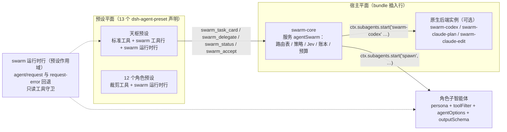

# dsh-agent-swarm 实现规格（适配 DSH 0.1.7-alpha.2）

- 日期：2026-09-23
- 上游设计：[`docs/V2-完整设计说明.md`](../../V2-完整设计说明.md)（下称「V2 设计稿」）
- 状态：设计已获批准，待实施计划
- 目标宿主：`@deepseek-ai/dsh@0.1.7-alpha.2`（npm `alpha` tag），并可随后续版本升级

本规格把 V2 设计稿落到 DSH 0.1.7-alpha.2 的真实接口上。V2 设计稿定义「做什么、验收什么」；本文定义「怎么接、接口长什么样、默认配置是什么」。两者冲突时以 V2 设计稿的验收标准为准，以本文的接口事实为准。

---

## 1. 目标与非目标

### 1.1 目标

1. 交付一个可安装的 DSH bundle `dsh-agent-swarm`：13 个中文角色预设、「衡鉴」规则 + Jev 分流、统一委派入口、证据账本、质量门禁、模型路由与回退。
2. 默认配置开箱可用：按用户订阅（DeepSeek API、qwen-token-plan-cn、opencode-go、ChatGPT Plus、Claude Pro、Jev）给出角色路由；qwen-token-plan-cn 有的模型优先走它，opencode-go 备用。
3. 适配 0.1.7-alpha.2，并通过能力探测、预设生成脚本和 `doctor` 支持后续升级。
4. 在隔离沙箱（独立 `DSH_HOME`）中完成真实 DSH 集成测试，不改动用户本机 DSH 0.1.5-alpha.1 与现有 `web` profile。

### 1.2 非目标

- 不重写联网搜索：`web_search`/`web_fetch` 由 DSH `tool-web` 提供，后端由用户已有或另装的 `dsh-web-search-free` 接管。
- 不把 ChatGPT Plus / Claude Pro 当 API key 使用：只通过官方原生后端 `@deepseek-ai/dsh-subagent-codex` / `@deepseek-ai/dsh-subagent-claude-code` 调用。不使用第三方 OAuth 桥接（如 `dsh-plugin-subscriptions`）作为默认路由。
- 不替用户升级本机 DSH、不读取用户凭据库中的密钥值。
- 不做 Web UI 自定义面板。实测更正：DSH 0.1.7-alpha.2 的 Web 端不会为插件自动生成配置表单（配置页需插件自带客户端组件），首版通过 profile 补丁覆盖 `swarm-core` 的 config；字段仍标为 volatile，以便配置编辑接口在线修改。

---

## 2. 已核实的宿主事实（0.1.7-alpha.2）

| 事实 | 来源 | 对本设计的影响 |
|---|---|---|
| 预设 = bundle 补丁插入的 `@deepseek-ai/dsh-agent-preset` 行，`config: {id, name, description, order, plugins}`；`id` 仅 `[a-z0-9-]` | `dsh-agent-preset` README、`editing-cordis-compositions` 技能 | 13 个预设用 ASCII id + 中文 `name` |
| 注册表 `@deepseek-ai/dsh-agent-preset-registry` 行 id `agent-preset-registry`，`config: {default}`；用户自选默认值存于 volatile `selectedDefault` | web-app `cordis.patch.yml` | 补丁覆盖 `default: tian-shu`，用户自选仍优先 |
| `dsh.bundle.patch` 可为文件数组 | web-app `package.json` | 宿主行与每个预设分文件 |
| `settings.yaml` 废止；插件可编辑设置 = Config 中 `.volatile()` 字段，持久化到 profile 补丁；读取时字段值为带 `.get()` 的引用 | `dsh-settings` README、`dsh-web-search-free` 源码 | 配置读取统一走 `readLive()` |
| `ctx.subagents.start(providerName, request)`；`spawn` 能力：`agentOptions/outputSchema/depthLimit/toolFilter/persona` 全部支持；`inheritsParentContext=false` | `dsh-subagent` 类型、`spawn` 源码 | 角色子智能体走 `spawn` 一次性运行 |
| `ToolRestriction = {allow?, deny?}`；未知工具名会抛错 | `dsh-tools` 类型 | 白名单在调用时按实际注册的工具名求交集 |
| 工具对象形状：`{name, description, parameters(JSON Schema), output:{schema, render}, execute(args, exec)}`；`exec.agent`、`exec.signal`；可选 `isConcurrencySafe(args)` | `defineTool` 源码 | 自带等价 `defineTool`，不依赖宿主内部包解析 |
| `agent/request`（waterfall，返回 `LlmCallConfig{provider, model, reasoningEffort?, maxTokens?}`）与 `agent/request-error`（waterfall，可返回 `{kind:'retry'}`；payload 含 `provider`、`failure{code,status,message}`）均为作用域事件 | `dsh-agent` 类型 | 回退监听器放在预设作用域行，只影响 swarm 预设的会话 |
| `ctx.llm.listProviders()`、`listModels(provider)`、`resolveModelInfo(provider, model)` → `inputModalities` | `dsh-llm` 类型 | 路由预检与视觉准入 |
| `ctx.credentials.resolve(ref)` / `describe(ref)`（不返回值） | `dsh-credentials` README | Jev 密钥通过引用名解析；doctor 只用 `describe` |
| 图片内容块 `{type:'image', attachment: ImageAttachmentRef}`，须先入附件库 | `dsh-llm` 类型、`dsh-attachment` README | 观象的工作区图片需经附件服务入库（见 §13 待验证点） |
| `qwen-token-plan-cn` 是 pi-ai 内置 provider，凭据引用 `QWEN_TOKEN_PLAN_CN_API_KEY`，OpenAI 兼容接口 | pi-ai `providers/qwen-token-plan-cn.js` | 用户在 Models 页添加即可，无需自定义 endpoint |
| 原生后端：`providerName`、`model`、`env`、`permissionMode`（Codex：`never` / `approve-for-me` / `dangerously-bypass-approvals-and-sandbox`；Claude Code：`dontAsk` / `acceptEdits` / `auto` / `plan` / `bypassPermissions`），一次性执行，不支持 persona/toolFilter/agentOptions | 两个后端 README | 以命名实例提供，指令自包含，宿主校验结果 |
| Jev：`POST https://api.typesafe.ai/v1/systemone`，`Authorization: Bearer`，`model: jev-latest`，题型 `choice`/`score`/`noul`；`noul` 无 confidence；错误码 401/422/429/529 | docs.typesafe.ai | `jev.ts` 适配 |
| `dsh-web-search-free@1.6.0` 在 `web` 接口背后注册搜索/抓取提供者，支持 dsh ≥ 0.1.6 | 该包 README / 补丁 | 博闻只需开放 `web_search`/`web_fetch` |

---

## 3. 架构



- **宿主行 `swarm-core`**（包主入口）：`ctx.provide('agentSwarm', service)`。持有 Config、路由解析、策略引擎、Jev 客户端、证据账本、预算与并发锁。不向模型注册任何工具。
- **预设行 `dsh-agent-swarm/tools`**：仅出现在天枢预设中，注入 `agentSwarm` 与 `tools`，注册 4 个模型工具。
- **预设行 `dsh-agent-swarm/runtime`**：出现在全部 13 个预设中，注入 `agentSwarm`。在预设作用域内注册 `agent/request` / `agent/request-error` 监听器（回退）和工具守卫（只读角色拒绝写操作）；对只读角色预设做作用域内的工具限制。
- 子智能体加入父会话的预设组合，因此运行时行对子智能体同样生效；子智能体通过 `toolFilter` 看不到 swarm 工具，`maxDepth: 1` 禁止再委派。

---

## 4. 包结构

```
dsh-agent-swarm/
  package.json            # name=dsh-agent-swarm；dsh.bundle.patch=[host, presets/*]；exports: ., ./tools, ./runtime
  cordis.patch.yml        # 宿主行 swarm-core、原生后端实例、注册表默认值
  presets/*.patch.yml     # 由 scripts/gen-presets 生成，13 个预设声明
  tsconfig.json
  src/
    index.ts              # 宿主插件 apply：provide('agentSwarm')
    tools.ts              # 预设插件：4 个工具
    runtime.ts            # 预设插件：回退监听、守卫、作用域限制
    service.ts            # SwarmService：组合下列模块，供 tools/runtime 调用
    config.ts             # Config schema（volatile）与 readLive
    role-registry.ts      # 13 角色 + 衡鉴：职责、权限、工具需求、输出契约、persona
    routes.ts             # 默认路由表、模型家族、availability 预检、链式回退
    policy.ts             # 规则门禁、预算、自动修复轮次
    jev.ts                # Jev 适配：脱敏、超时、重试、预算、规则回退
    delegate.ts           # spawn / 原生后端委派、白名单计算、结果校验
    evidence.ts           # 账本（JSONL）、状态机、验收判定
    verification.ts       # 复核输出契约与证据校验
    vision.ts             # 观象准入：模型图片能力、图片入库
    tool-shape.ts         # 本地 defineTool 等价实现
    util/…                # readLive、错误类型、id 生成、git 快照
  scripts/
    gen-presets.mjs       # 读取已安装 DSH 的 standard 预设 + 角色注册表 → presets/*.patch.yml
    doctor.mjs            # 版本、provider、后端、凭据引用（仅存在性）检查
    sandbox.mjs           # 在隔离 DSH_HOME 安装指定 DSH 版本并挂载本包
  config/
    roles.example.yaml    # 可复制到 profile 补丁的路由覆盖示例（无密钥）
    policy.example.yaml
  tests/
    unit/*.test.ts        # policy / routes / role-contracts / jev / evidence / delegate / vision / config
    fixtures/route-fixtures.json、triage-fixtures.json、eval-tasks.example.json
    integration/*.test.ts # 沙箱：dump-config、无头启动 + mock LLM
  docs/
    安装.md 使用.md 角色.md 升级与回退.md 评测.md
```

代码风格遵循用户全局规范：箭头函数、命名导出、无分号、2 空格、中文 JSDoc；函数前缀 `get/Add/Del/Find/int/Update/Validate`；常量全大写；配置对象以 `Info` 结尾。

---

## 5. Bundle 补丁组成

`cordis.patch.yml`（宿主层）：

```yaml
- insert:
    - id: swarm-core
      name: dsh-agent-swarm
      config: {}                 # 全部取默认值；用户通过 profile 补丁覆盖
    - id: swarm-codex            # 仅当 @deepseek-ai/dsh-subagent-codex 可解析时启用
      name: '@deepseek-ai/dsh-subagent-codex'
      disabled: !!js <包不可解析>
      config: { providerName: swarm-codex, permissionMode: never }
    - id: swarm-claude-plan
      name: '@deepseek-ai/dsh-subagent-claude-code'
      disabled: !!js <包不可解析>
      config: { providerName: swarm-claude-plan, permissionMode: plan }
    - id: swarm-claude-edit
      name: '@deepseek-ai/dsh-subagent-claude-code'
      disabled: !!js <包不可解析>
      config: { providerName: swarm-claude-edit, permissionMode: acceptEdits }
- id: agent-preset-registry
  config: { default: tian-shu }
```

`presets/<id>.patch.yml`：每个文件插入一行 `preset-<id>`，`name: '@deepseek-ai/dsh-agent-preset'`。天枢的 `plugins` 以已安装 DSH 的 `standard` 预设为底，替换 persona，追加 `dsh-agent-swarm/tools` 与 `dsh-agent-swarm/runtime` 两行。角色预设以 `standard` 为底，替换 persona，按角色去掉不需要的行（例如只读角色去掉 `tool-subagent*`、`tool-ralph`、`tool-workflow`），追加 `runtime` 行并带 `{role}` 配置。

「包不可解析」表达式的具体写法在实施中于沙箱验证（§13 V1）。若 Loader 表达式无法可靠判断，退化方案是：这三行不进 bundle，由 `docs/安装.md` 提供可粘贴到 profile 补丁的片段，并由 `doctor` 检查。

---

## 6. 角色注册表

内部 RoleId 用下划线，预设 id 用连字符。

| RoleId / 预设 id | 中文名 | 权限 | 工具需求（能力名 → 实际工具名在调用时解析） | 必须交付（outputSchema 要点） |
|---|---|---|---|---|
| `tian_shu` / `tian-shu` | 天枢 | 主会话 | 标准全量 + swarm 工具 | 任务卡、选用角色与理由、验收结论、未解决问题 |
| `mou_ding` / `mou-ding` | 谋定 | read | read, search | `constraints[]`、`options[]`、`decisions[]`、`dependencies[]` |
| `shu_ji` / `shu-ji` | 枢机 | read(+web 按需) | read, search, web? | `boundaries[]`、`interfaces[]`、`failureScenarios[]`、`migration`、`rollback` |
| `suan_heng` / `suan-heng` | 算衡（研算 / 验算） | read(+web 按需) | read, search, web?（不含 shell：数值验证程序由算衡给出，交复核实际运行） | `premises[]`、`definitions[]`、`invariants[]`、`claims[]`、`proofOrCounterexample[]`、`complexity`、`numericError`、`uncovered[]` |
| `tan_wei` / `tan-wei` | 探微 | read | read, search | `findings[{path, symbol, callChain, evidence}]` |
| `bo_wen` / `bo-wen` | 博闻 | read + web | read, web | `sources[{url, date, version, points[]}]` |
| `guan_xiang` / `guan-xiang` | 观象 | read（需视觉模型） | read | `observations[{region, element, evidence}]`、`inferences[]`、`uncertainties[]` |
| `zhu_jian` / `zhu-jian` | 铸剑 | workspace-edit | read, search, edit, shell | `summary`、`changedFiles[]`、`assumptions[]`、`toVerify[]` |
| `xing_zhou` / `xing-zhou` | 行舟 | limited-exec | read, shell | `steps[{command, cwd, exitCode, artifacts[], notRunReason?}]` |
| `ji_feng` / `ji-feng` | 疾风 | workspace-edit | read, search, edit, shell | `changedFiles[]`、`localChecks[{command, exitCode}]` |
| `yu_shi` / `yu-shi` | 御史 | read | read, search | `findings[{severity, location, issue, repro, suggestion}]` |
| `fu_he` / `fu-he` | 复核 | verify | read, search, shell | `plan[]`、`commands[{command, exitCode, summary, kind}]`、`coverage`、`failures[{command, explanation}]`、`verdict` |
| `miao_bi` / `miao-bi` | 妙笔 | read(+web 按需) | read, search | `candidates[{text, scenario}]`（2–3 个）、`recommendation`、`rationale` |
| `heng_jian` | 衡鉴 | 服务 | —（规则 + Jev，不生成代码、无预设） | `classification`、`confidence`、`rulesApplied[]`、`fallbackReason?` |

「web 按需」指：枢机、算衡、妙笔默认不带 web 工具，只有 `swarm_delegate` 传入 `allow_web: true` 时才开放；博闻始终带 web；其他角色传入 `allow_web` 会被拒绝。

能力到工具名的映射在 `host-contract.ts` 中列出（0.1.7-alpha.2 实测）：`read → [read, read_image]`、`search → [glob, grep]`、`edit → [write, edit]`、`shell → [pwsh, bash]`、`web → [web_search, web_fetch]`。调用时与父会话实际可见的工具集求交集，得到 `toolFilter.allow`；白名单之外的工具（`swarm_*`、委派、目标、`todo_write`、`ask_user_question`、`exit_plan_mode` 等）对子智能体一律不可见。

persona 由注册表生成，内容包括：中文职责、边界（例如「行舟不改写业务逻辑」「观象只陈述可见事实」）、交付契约、「只通过结构化结果交付」，并带机器可读标签 `[[swarm:role=<id>]]`。

---

## 7. 模型路由

### 7.1 默认路由表

`qwen` = `qwen-token-plan-cn`，`go` = `opencode-go`，`ds` = `deepseek-official`。

| 角色 | 链（首选 → 备用） | 升级通道（按需） |
|---|---|---|
| 天枢 | qwen/deepseek-v4-pro → go/deepseek-v4-pro → ds/deepseek-v4-pro | — |
| 谋定 | qwen/qwen3.8-max → go/qwen3.8-max → qwen/deepseek-v4-pro | swarm-codex |
| 枢机 | qwen/deepseek-v4-pro → go/deepseek-v4-pro → qwen/glm-5.2 | swarm-claude-plan |
| 算衡·研算 | qwen/deepseek-v4-pro(max) → go/deepseek-v4-pro(max) → ds/deepseek-v4-pro(max) | swarm-codex |
| 算衡·验算 | qwen/qwen3.8-max → go/qwen3.8-max → go/glm-5.3 | swarm-codex |
| 探微 | go/mimo-v2.5-pro → qwen/kimi-k2.7-code → qwen/qwen3.8-flash | — |
| 博闻 | qwen/kimi-k2.6 → go/kimi-k2.6 → go/minimax-m3 | — |
| 观象 | qwen/qwen3.8-max → go/qwen3.8-max → qwen/kimi-k2.6 → go/deepseek-v4-flash-vision-exp | — |
| 铸剑 | qwen/kimi-k2.7-code → go/kimi-k2.7-code → qwen/deepseek-v4-pro | swarm-claude-edit |
| 行舟 | qwen/deepseek-v4-flash → go/deepseek-v4-flash → qwen/qwen3.8-flash | — |
| 疾风 | qwen/deepseek-v4-flash → go/deepseek-v4-flash → qwen/qwen3.8-flash | — |
| 御史 | qwen/glm-5.2 → go/glm-5.2 → go/glm-5.3 | swarm-codex |
| 复核 | qwen/qwen3.8-flash → go/qwen3.8-flash → qwen/deepseek-v4-flash | — |
| 妙笔 | qwen/qwen3.8-max → go/qwen3.8-max → qwen/kimi-k2.6 | — |

实现时的调整：多数链的末尾追加了 DeepSeek 官方路由作为最终兜底（`ds/deepseek-v4-pro` 或 `ds/deepseek-flash`；观象用支持图片的 `ds/deepseek-flash`）。**权威定义以 `src/routes.ts` 与 `docs/角色.md` 为准**，单元测试会检查两者一致，并检查「qwen 优先」规则。

### 7.2 路由规则

1. **qwen 优先规则**：以 `routes.ts` 中两份目录的交集为依据（deepseek-v4-pro/flash、qwen3.8-max/flash、qwen3.7-max/plus、qwen3.6-plus、kimi-k2.6、kimi-k2.7-code、glm-5.1、glm-5.2）。单元测试断言：默认链中凡是 qwen 目录有的模型，qwen 路由排在同模型的 go 路由之前。
2. **可用性预检**（委派前）：provider 必须出现在 `ctx.llm.listProviders()`，且 `resolveModelInfo` 成功，否则跳过并在账本记录跳过原因（例如 `provider-not-configured`）。
3. **能力约束**：观象的链只保留 `inputModalities` 含 `image` 的路由，全部不可用时返回 `blocked`，绝不降级到纯文本模型。
4. **独立性**：模型家族表（deepseek、qwen、kimi、glm、minimax、mimo、gpt、grok、claude、hy、longcat）。御史与本任务最近一次铸剑/疾风的实际家族必须不同；算衡·验算与本任务研算的家族必须不同。选链时跳过同家族路由；做不到时仍然执行，但在结果和账本中写明 `independence: not-achieved`。
5. **运行中回退**：`agent/request-error` 的失败码属于 `NO_ADAPTER`、`UNKNOWN_MODEL`、`MISSING_CREDENTIAL`、`INVALID_CREDENTIAL`、`QUOTA`，或状态码为 4xx 且不是 429，视为路由致命。此时把该子智能体（或天枢根会话）推进到链上下一条，返回 `{kind:'retry'}`，下一次 `agent/request` 改写 provider/model/reasoningEffort。`RATE_LIMIT`/429/5xx 交给 DSH `llm-retry` 按其策略处理，重试用尽后再按致命处理。每个 agent 最多切换「链长度 − 1」次；认证失败不在同一路由上重试。
6. **天枢根会话**：尊重模型选择器，平时不改写路由；仅当选择器路由致命失败时，按天枢链回退（Config `rootFallback: true` 默认开启）。
7. **原生后端**：只有在 `swarm_delegate` 的 `backend` 参数显式为 `codex`/`claude`，或策略判定高风险且 Config `nativeEscalation: 'auto'` 时才使用。每个会话默认上限 3 次（Config 可调）。实例不存在时退回 API 链，并记录 `native-unavailable`。

---

## 8. 策略与衡鉴

### 8.1 任务卡字段（`swarm_task_card` 入参）

`title`、`goal`、`acceptance[]`、`scope[]`（路径/模块）、`constraints{api兼容, 环境, 资源上限}`、`perf{p95Ms?, p99Ms?, throughput?, dataScale?}`（未知填「待测」）、风险标志布尔：`changesCode`、`changesAlgorithm`、`touchesFinancialLogic`、`timeSeriesOrBacktest`、`stateMachine`、`numericPrecision`、`sharedStateConcurrency`、`crossModuleArchitecture`、`securitySensitive`、`hasVisualInput`、`uiCopy`、`hasExecSteps`、`needsExternalFacts`、`ambiguousRequirements`。

### 8.2 强制门禁规则（确定性，先于 Jev）

| 门禁 | 触发 | 满足条件 |
|---|---|---|
| `G_VERIFY` 复核 | `changesCode`，或任务中出现过铸剑/疾风委派 | 复核结果 `commands[]` 至少 1 条带 `exitCode`，且 `verdict` 为 pass；fail 时门禁不通过 |
| `G_REVIEW` 御史 | `crossModuleArchitecture`、`sharedStateConcurrency`、`changesAlgorithm`、`securitySensitive`、`touchesFinancialLogic`、`timeSeriesOrBacktest`，或 Jev novelty 达阈值 | 御史结果存在，且没有未处理的 critical/high 发现（处理结果由天枢在 `swarm_accept` 中逐条说明） |
| `G_MATH_RESEARCH` 算衡·研算 | `changesAlgorithm`，或 Jev `math_task=research` | 研算结果含 invariants 与 complexity |
| `G_MATH_VERIFY` 算衡·验算 | `touchesFinancialLogic`、`timeSeriesOrBacktest`、`stateMachine`、`numericPrecision`、`sharedStateConcurrency`，或 Jev 升级 | 验算结果存在，且与研算家族不同（做不到时标注） |
| `G_DIFF_TEST` 差分/性质测试 | `touchesFinancialLogic` 或 `timeSeriesOrBacktest`，并且 `changesAlgorithm` | 复核 `commands[]` 中至少 1 条 `kind ∈ {differential, property}` 且通过 |
| `G_BENCH` 基准 | 声明了 `perf`，或 Jev `need_benchmark ≥ 阈值` | 复核 `commands[]` 至少 1 条 `kind=benchmark` 且带数值摘要 |
| `G_VISION` 观象 | `hasVisualInput` | 观象结果存在，状态不是 blocked |

门禁只能由规则或 Jev **增加**，不能被移除。缺少任何必需门禁的证据时，`swarm_accept` 只能返回 `blocked` 或 `incomplete`。

### 8.3 Jev 分流（衡鉴）

- 仅在规则判定之后、且任务并非完全由规则决定时调用。例如所有相关风险标志都已为 true，Jev 不会改变结果，就跳过调用。
- 请求：`model: jev-latest`；`state` 只含任务卡的结构化摘要（标题、布尔标志、perf 数值、角色计划），不含源码、路径内容和密钥；`questions` 为 V2 设计稿 §4 的 `math_task`（choice）、`need_benchmark`（noul）、`novelty`（score）。
- 程序只读取 `answers.math_task.choice/confidence`、`answers.need_benchmark.noul`、`answers.novelty.score/confidence`。
- 默认阈值（保守，可配置，附标注集供校准）：`math_task` 为 `invariant/equivalence/research` 且 confidence ≥ 0.6 → 加 `G_MATH_VERIFY`（research 另加 `G_MATH_RESEARCH`）；`need_benchmark ≥ 0.5` → 加 `G_BENCH`；`novelty.score ≥ 1.0`（0–2 刻度）且 confidence ≥ 0.5 → 加 `G_REVIEW`。
- 失败处理：超时（默认 10 s）、429/529 做指数退避，最多重试 2 次；401 或未配置密钥时不重试。出现任何失败、`math_task` confidence 低于阈值、或超出预算（默认每会话 20 次），都按「严格路径」处理：`changesAlgorithm` 时加 `G_MATH_VERIFY` 与 `G_REVIEW`，并记录 `fallbackReason`。
- 密钥：Config `jev.apiKeyEnv`，默认 `TYPESAFE_API_KEY`，通过 `ctx.credentials.resolve` 解析；拿不到时回退读取同名环境变量。

### 8.4 预算

| 项目 | 默认值 |
|---|---|
| 每任务最多委派数 | 20 |
| 每角色每任务最多调用次数 | 4（铸剑 6） |
| 自动修复轮次 | 2 |
| 单次委派超时 | 30 min |
| 原生后端每会话调用上限 | codex 3、claude 3 |
| Jev 每会话调用上限 | 20 |

超出预算时返回 `blocked`，并说明阻塞原因。

---

## 9. 模型工具接口（仅天枢）

工具名为 ASCII，描述为中文。所有返回值都是 JSON，`output.render` 输出紧凑文本，供模型阅读。

1. `swarm_task_card` — 建立/更新任务卡
   - 入参：§8.1 字段；可选 `task_id` 用于更新。
   - 返回：`{task_id, requiredGates[], suggestedRoles[{role, reason}], triage{source: 'rules'|'jev'|'rules+jev', classification, confidence?, rulesApplied[], fallbackReason?}, budgets}`。
2. `swarm_delegate` — 委派专家
   - 入参：`task_id`、`role`（12 个 RoleId 枚举，描述中带中文名）、`mode?`（算衡：`research|verify`）、`prompt`（自包含任务说明）、`context_paths?[]`、`image_paths?[]`（观象）、`backend?: auto|api|codex|claude`（默认 auto）、`allow_web?`（仅枢机/算衡/妙笔）、`gate?`（声明本次委派用于满足哪个门禁）。
   - 行为：预算检查 → 路由选择（§7）→ 视觉准入 → 编辑类角色做前置 git 快照 → `ctx.subagents.start` → 校验 outputSchema → 编辑类角色做后置快照、计算改动文件 → 写账本。
   - 返回：`TaskResult{taskId, delegationId, role, roleName, status, summary, structured, evidence[], route{provider, model, backend, attempts[]}, independence, changedFiles?, unresolved[], durationMs}`。
   - 并发：`isConcurrencySafe` 对只读/验证角色返回 true，对编辑和执行角色（铸剑、疾风、行舟）返回 false。
3. `swarm_status` — 查询任务状态
   - 入参：`task_id?`、`verbose?`。
   - 返回：任务卡、门禁满足情况、委派列表（状态/路由/耗时）、预算余量，以及 `ledgerPath`（账本文件路径，不含任何密钥）。
4. `swarm_accept` — 验收
   - 入参：`task_id`、`decision: accept|reject|incomplete`、`summary`、`findingResolutions?[{delegationId, index, resolution}]`、`unresolved[]`、`stopReason`。
   - 行为：`decision=accept` 时逐项验证门禁证据；任何一项缺失，返回 `{status:'blocked', missing[]}` 且不记为已验收。`reject` 会把自动修复轮次 +1，超过上限时返回 `blocked`。
   - 返回：`{status: accepted|blocked|recorded, missing[], roundsUsed, stopReason}`。

---

## 10. 委派执行细节

- **spawn 请求**：`{label: '<中文名>·<task_id>', prompt: [{type:'text', text}], parent: exec.agent, signal: exec.signal, agentOptions: {provider, model, reasoningEffort?}, outputSchema: 角色契约, maxDepth: 1, toolFilter: {allow}, persona}`。前台等待 `run.result`，结束后一定调用 `run.dispose()`。
- **原生后端请求**：`prompt` 为自包含的中文指令，包括角色职责、边界、输出格式要求（以 fenced JSON 输出契约），不带 persona/toolFilter/agentOptions/outputSchema。返回文本后，宿主抽取 JSON 并按角色 schema 校验；不合格即判 `failed`，保留原文摘要。账本标注 `hardIsolation: false`。
- **视觉**：`image_paths` 必须位于工作区内（拒绝 `..` 和绝对路径越界），格式为 PNG/JPEG/WebP/GIF。图片经附件服务入库后作为 `image` 块附在 prompt 中。路由模型不支持图片时换链上下一条；全部不支持时返回 `blocked`，原因为 `vision-unsupported`。
- **git 快照**：若工作区是 git 仓库，执行前后各跑一次 `git status --porcelain=v1 -z`，差集即为 `changedFiles`；非 git 仓库时记录 `changeTracking: unavailable`。取消任务时照样生成后置快照，但不回滚。
- **编辑串行锁**：同一根会话内，编辑类委派持有互斥锁；只读委派不加锁。

---

## 11. 证据账本与状态

- 文件：`<dshHome>/share/dsh-agent-swarm/ledger/<rootSessionId>.jsonl`，追加写入；Config `ledger.dir` 可改。
- 事件：`task/card`、`delegation/queued`、`delegation/running`、`delegation/completed|failed|blocked`、`route/skipped`、`route/fallback`、`jev/call`、`gate/satisfied`、`accept/decision`。每条事件含 `ts`、`taskId`、`role`、`roleName`、`provider`、`model`、`backend`、`reason`、`durationMs`、`usage?`。永不写入密钥、完整 prompt 或源码，只写摘要和哈希。
- 内存状态由账本折叠得到。进程重启后，`swarm_status` 可以从账本恢复只读视图。
- 状态机：`queued → running → completed | failed | blocked`，终态不可再变。

---

## 12. 配置（`swarm-core` Config，字段均为 volatile）

```yaml
routes:            # RoleId -> { chain: [{provider, model, reasoningEffort?}], escalation?: codex|claude-plan|claude-edit }
rootFallback: true
nativeEscalation: manual      # manual | auto
native: { codexProvider: swarm-codex, claudePlanProvider: swarm-claude-plan, claudeEditProvider: swarm-claude-edit, maxCallsPerSession: 3 }
jev: { enabled: true, apiKeyEnv: TYPESAFE_API_KEY, baseUrl: https://api.typesafe.ai, model: jev-latest, timeoutMs: 10000, maxRetries: 2, maxCallsPerSession: 20, thresholds: {...} }
budgets: { maxDelegationsPerTask: 20, maxCallsPerRole: 4, maxCallsZhuJian: 6, maxAutoFixRounds: 2, delegationTimeoutMs: 1800000 }
ledger: { dir: '' }           # 空 = <dshHome>/share/dsh-agent-swarm/ledger
```

未填写的字段取 `routes.ts` / `policy.ts` 中的默认值。`routes` 覆盖按角色整体替换。`config/roles.example.yaml` 给出一份可粘贴到 profile 补丁的覆盖示例。

---

## 13. 实施中需在沙箱验证的点（带退化方案）

| # | 待验证 | 退化方案 | 实测结果（2026-09-23，沙箱 DSH 0.1.7-alpha.2） |
|---|---|---|---|
| V1 | bundle 行 `disabled: !!js` 能否判断可选包可解析 | 原生实例改由文档片段 + doctor 提供 | 用 `ctx.get('profileContext')?.startedBundles?.includes(...)` 判断，已采用；未安装时行保持禁用、宿主正常启动 |
| V2 | 预设作用域行注册的 `agent/request(-error)` 能收到子智能体事件 | 改为宿主行监听，并用自有 childId 集合过滤 | 能收到（子会话 `header.parentSession` 指向父会话、`agentPreset` 与父相同），已采用；返回 `{kind:'retry'}` 后下一次请求可改写路由 |
| V3 | 附件服务在插件内把工作区图片入库的 API | 观象的委派只接受会话内已有附件 | `ctx.attachments.saveImages([{ data, mediaType, name }])` 返回引用，已采用 |
| V4 | 作用域内 `ctx.tools.restrict` / 工具守卫对角色预设可用 | 角色预设只通过去掉插件行来裁剪工具 | 作用域内注册的工具不能 restrict；改为子智能体 `toolFilter.allow`（对预设作用域工具同样生效）+ 宿主全局 `tools.guard` 拒绝只读类角色的写操作，已采用 |
| V5 | 第三方包能否 import `@deepseek-ai/schemastery` | Config 用 JSON Schema 手写 | 从 link 安装的包无法解析宿主内部包；在本包 `dependencies` 声明后可用，已采用 |
| V6 | 子智能体能否加入父会话预设组合 | 把运行时行为挂到宿主行 | 能加入，已采用 |

其他实测更正：子智能体 dispose 时宿主触发 `agent/disposed`，运行时行会清理路由状态，因此最终路由必须在 dispose 之前读取（已修复并有回归测试）；DeepSeek 官方 provider 的模型为 `deepseek-v4-pro` 与 `deepseek-flash`（后者支持图片），§7.1 的链尾按此配置。

每一项在实施计划里都有对应的验证任务。验证结果写回本节。

---

## 14. 升级策略

1. `package.json`：`dsh.minVersion: 0.1.7-alpha.2`，`dsh.testedVersions: [0.1.7-alpha.2]`；peerDependencies 只声明 `@deepseek-ai/cordis ~4.0.4`。
2. 能力探测：启动时检查 `ctx.subagents.getProvider('spawn').capabilities`、`ctx.llm` 方法和事件是否存在；缺失时降级并写日志，`swarm_status` 显示降级项。
3. `npm run sync-dsh -- --dsh <path|version>`：在沙箱安装目标版本，用它的 `standard` 预设重新生成 `presets/*.patch.yml`，跑全部测试（含集成测试），并在 `testedVersions` 中追加该版本。
4. `npm run doctor`：报告宿主版本、provider 是否就绪（`qwen-token-plan-cn`、`opencode-go`、`deepseek-official`）、原生后端、Jev 凭据引用是否已配置（只报是否存在）。
5. 所有对宿主的假设集中放在 `src/host-contract.ts`，并由集成测试覆盖；升级时只需要看这一个文件和测试结果。

---

## 15. 测试策略

- **单元测试（vitest，覆盖率 ≥ 80%）**
  - `policy.test.ts`：门禁规则、只增不减、预算、修复轮次；
  - `routes.test.ts`：qwen 优先断言、可用性跳过、视觉链过滤、家族独立性、致命错误分类、链推进；
  - `role-contracts.test.ts`：13 角色都有预设、persona、工具需求、schema、可触发路径，权限与工具需求一致（只读角色不含 edit）；
  - `jev.test.ts`：mock fetch，覆盖脱敏、阈值、429/529 重试、超时、401、预算、`noul` 无 confidence；
  - `evidence.test.ts`：账本读写、状态机、验收判定；
  - `delegate.test.ts`：fake `ctx.subagents`，覆盖白名单交集、outputSchema 失败、原生文本校验、编辑锁、git 快照；
  - `vision.test.ts`：图片能力准入、越界路径拒绝、blocked。
- **集成测试（沙箱中的真实 DSH 0.1.7-alpha.2）**
  - `dump-config.test.ts`：13 个 `preset-*` 行、`swarm-core` 行、注册表默认值 `tian-shu`；
  - `boot.test.ts`：无头 profile 配合 DSH 自带 mock LLM（若可用），走通 task_card → delegate（复核）→ accept 的阻塞与通过路径、路由回退路径、观象拒收路径。
- **故障注入**：配额耗尽、Jev 超时、认证失败、取消、权限拒绝，各有至少一个用例断言不会被报告为完成。
- **评测框架**：`tests/fixtures/eval-tasks.example.json` 加 `docs/评测.md`，覆盖 V2 设计稿 §8 的 20 题与 4 个必测案例；需要用户在本机带真实密钥运行。

---

## 16. 交付与验收

| 交付物 | 本次在沙箱验证 | 需用户在本机验证 |
|---|---|---|
| bundle 可安装，dump-config 可见 13 个预设 | ✓ | ✓（升级到 0.1.7 后） |
| 路由/门禁/回退/视觉拒收逻辑 | ✓（mock） | 真实 provider |
| Jev 适配 | ✓（mock） | 真实密钥 |
| 原生 Codex/Claude 后端 | 实例配置与缺失降级 | 登录后的真实调用 |
| 20 题评测 | 框架与示例 | 实际运行 |

完成声明规则：沙箱部分全部通过，只能称「构建完成、沙箱验收通过」；只有用户本机的真实调用和评测也通过，才能称「V2 构建完成」。

---

## 17. 风险

- 0.1.7 是 alpha 版，接口可能继续变动。缓解：`host-contract.ts`、`sync-dsh`、集成测试。
- 用户本机升级到 0.1.7 后，旧式预设目录（vibe-math、rigorquant、ultramath）不再被读取，`settings.yaml` 被迁移。`docs/升级与回退.md` 给出备份、升级、回退（`npm i -g @deepseek-ai/dsh@0.1.5-alpha.1`）步骤。
- 原生后端无硬隔离。缓解：默认手动触发、调用上限、宿主校验结果、账本标注。
- Jev 可能误判。缓解：Jev 只能加门禁，阈值保守，并提供标注集供校准。
